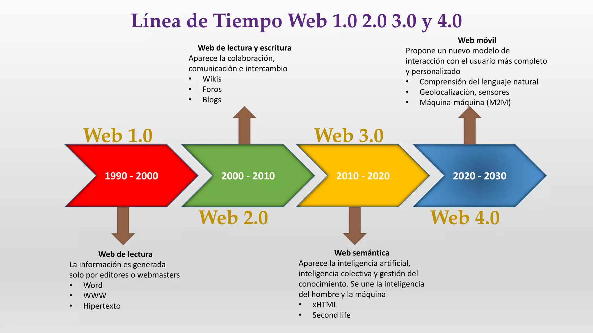
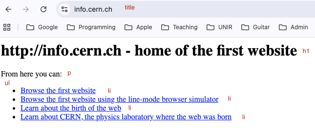
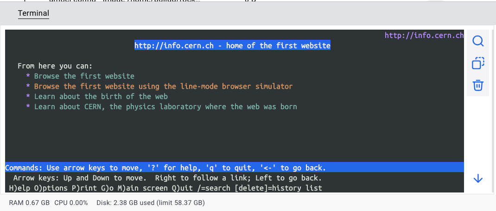
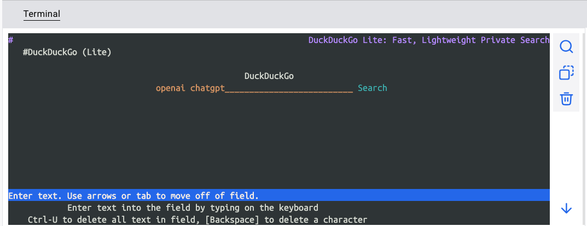

# Historia de WWW

https://info.cern.ch/

Web 1.0: estática
Web 2.0: interactiva y social
Web 3.0: descentralizada (semantic web)



[Web 1](https://www.lxahub.com/stories/whats-the-difference-between-web-1.0-web-2.0-and-web-3.0)

[Profesor: Mostrar algunos comandos básicos de HTML mcon VS Code]

# Ejercicio Práctico

Con VS Code (IDE), vamos a emular esta primera página en la historia. Fíjate en las etiquetas en rojo. 




## Ejercicio de lectura - Historia de la web (deberes)

[Web 1](https://gredos.usal.es/bitstream/handle/10366/132322/El_inicio_de_la_Web_historia_y_cronologi.pdf?sequence=1)


Leer el documento y contestar las preguntas y completarlas:

1. El inicio de la Web
 - ¿qué es ARPANET?
 - ¿HTML es compilado a un programa?
 -  El lenguaje HTML se basa principalmente en un sistema de _________ que indica
al navegador dónde está el cuerpo de un documento, cuándo hay que ________ un texto, etc. HTML tiene sus limitaciones y por ello
veremos cómo posteriormente se desarrollarán «lenguajes auxiliares» como
________ o __________, para implementar estilos o ejecutar
acciones en los documentos Web.
- la primera versión que conceptualizó __________ en 1991.
-  el ________ era un protocolo muy simple con el cual se podía implementar el formato de texto HTML, en cualquier máquina, __________ del ________ que utilizase.

2. La consolidación
- En marzo de ________, Lou Montulli se convierte en la primera persona en
escribir un navegador basado en texto, el cual recibe el nombre de ______. 
- En 1993, la primera versión de Mosaic tiene muchas más características de las
que existen en la especificación de Tim Berners-Lee, ya que emplea __________, ________ y ________.
- !Muy interesante! https://en.wikipedia.org/wiki/Graphical_user_interface


2.1. Mosaic
- Aunque técnicamente no fue el primer navegador en ver la luz, la importancia de Mosaic en el inicio de la Web es incontestable, ya que fue el navegador que __________ la World Wide Web.

3. La Web se asienta
- En noviembre de ______, se forma Netscape Communications Corporation.
- A finales de 1994 se forma el ________ (de aquí en adelante W3C), para aprovechar el potencial de la Web, mediante el desarrollo de
estándares abiertos

3.3. Browser Wars (guerra de navegadores)
- La guerra de navegadores es un término alegórico con el que se conoce
al periodo en el cual las compañías ________ y ______
se enfrentaron por el dominio de la cuota de mercado en navegadores Web. 


## Lynx - un navegador de la historia 

Hay que tener un ubuntu docker contenedor para esta actividad





```
docker run -it ubuntu bash

apt update
apt install lynx
lynx http://info.cern.ch

# Intentar acceder a https://lite.duckduckgo.com y https://www.w3.org/
```
