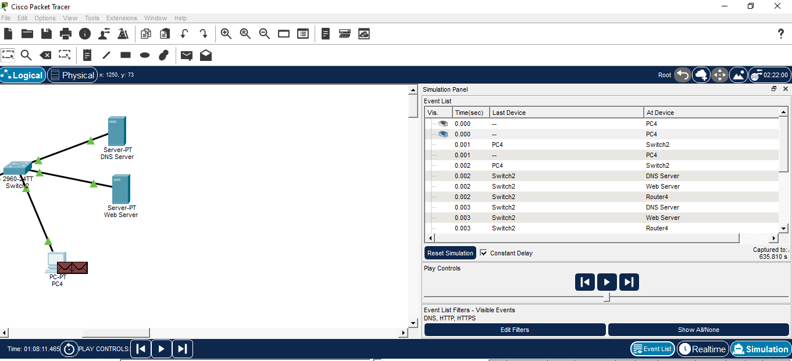
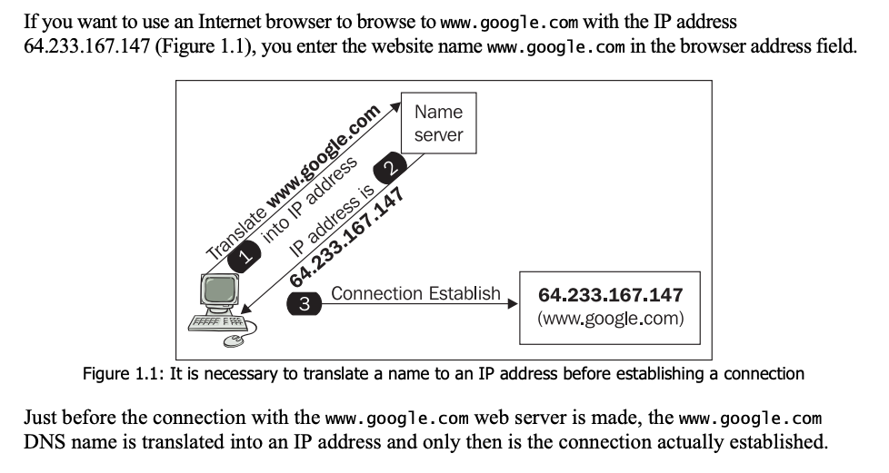
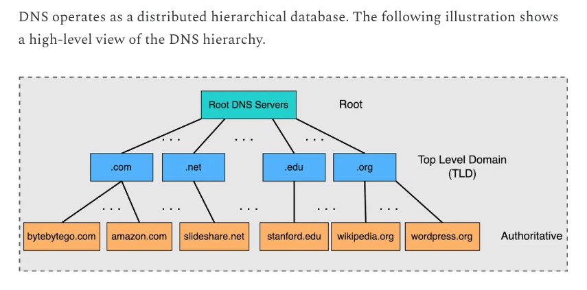
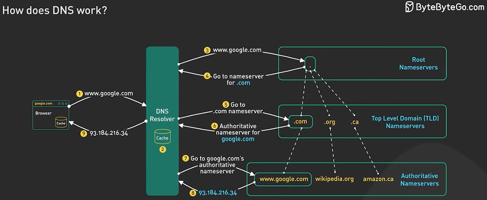
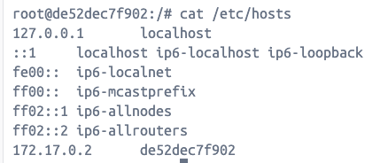
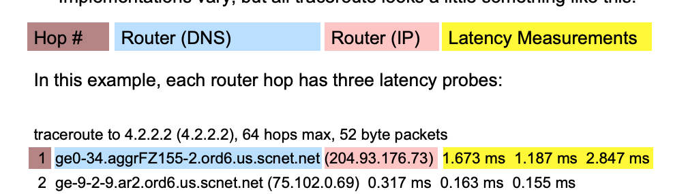

Cisco Packet Tracer
Filtrar por HTTP, HTTPS y DNS

IP4 address:  192.168.10.1   and 2
IP6 address: 2001:DB8:acad::1   64  and 2


arp -a
switch: show mac address-table
exit, exit in router
show ip route

show ip interface brief


# DNS 
Vamos a usar Docker para las actividades de DNS


```
docker run
    |
    |-- 1. Docker busca la imagen en el equipo local
    |
    |-- 2. ¿Está disponible "ubuntu:latest"?
    |        |
    |        No
    |
    |-- 3. Docker descarga la imagen desde Docker Hub
    |
    |-- 4. Docker crea un nuevo contenedor usando esa imagen
    |
    |-- 5. Docker arranca el contenedor
    |
    |-- 6. Tu terminal queda conectada al shell del contenedor (bash)
```
    


docker run -it ubuntu bash
exit
docker ps -a
docker start -ai [nombre o id]








https://root-servers.org/
https://www.iana.org/whois


```
nslookup google.com
```

Para echar un vistazo el DNS Resolver. Ten en cuenta que Docker, probablemente ha creado su propia capa para la gestion de los resolvers (Docker DNS proxy).

```
cat /etc/resolv.conf
```

# Domain Information Groper (y ping) para DNS Queries

Vamos a usar dig para entender mejor el DNS, sistema para la gestión de domain names.

apt update
apt install dnsutils -y
apt install iputils-ping -y


dig google.com
host google.com


Primero, en Linux mirar en hosts, y luego usa un name resolver:

cat /etc/hosts
host localhost

dig @8.8.8.8 google.com   # usar Google DNS Resolver  => no ISP Resolver e.g Orange
dig @1.1.1.1 google.com   # usar Cloudfare DNS Resolver => no ISP Resolver e.g Orange


dig . NS   # root server
dig com NS. # TLDs
dig es NS

dig google.com NS  # authoritive servers

Do a complete DNS lookup yourself, starting from the DNS root servers. Do not rely on my normal recursive resolver:

dig google.com +trace

### Root servers
dig a.root-servers.net
whois 198.41.0.4  # Para saber qué compañia lo gestiona


| Status   | Meaning                      |
| -------- | ---------------------------- |
| NOERROR  | Domain resolved successfully |
| NXDOMAIN | Domain does not exist        |
| SERVFAIL | DNS server failed            |
| REFUSED  | DNS server refused the query |


¿Por qué recibo 'status: NXDOMAIN' al ejecutar estos comandos, pero el ping funciona?

```
cat /etc/hosts
```



```
ping de52dec7f902
dig de52dec7f902
```

## Actividad 1
Vas a modificar el hosts archivo para que lo suiguente ocurre
ping app.local # resultado exito
dig app.local   # resultado fail


# Trace route y trace path
apt install iputils-tracepath -y
apt install traceroute -y





traceroute www.ripe.net


Más sencillo tracepath
tracepath google.com

TO DO


dnsmasq

# Vínculos importantes

| Recurso | Descripción | URL |
|----------|-------------|-----|
| Introducción a HTML (Universidad de Valencia) | Manual en formato PDF que explica los fundamentos de HTML, la estructura de una página web y las principales etiquetas del lenguaje. | https://www.uv.es/fragar/html/pdf/html01.pdf |
| DNS | Manual en formato PDF que explica los fundamentos de DNS. | https://josejuansanchez.org/daw/introduccion_dns/index.pdf |
| DNS Names | Excelente video en inglés | https://www.youtube.com/watch?v=27r4Bzuj5NQ |


## Respuestas
echo "172.17.0.2 app.local" >> /etc/hosts