# Nginx

https://www.youtube.com/watch?v=QiUV9b6sC_U. (vocabulario: páginas estáticas vs dinámicas, Apache vs Nginx)

El problema **C10k** es el desafío clásico de optimizar servidores de red para que puedan gestionar 10.000 conexiones simultáneas de clientes.

El término fue acuñado por *Dan Kegel* en 1999 y se centra en la gestión de la concurrencia, es decir, en cómo mantener de forma eficiente miles de conexiones abiertas, ya sean inactivas, de larga duración o activas.

El problema no trata principalmente del rendimiento en términos de datos procesados o peticiones por segundo, sino de la capacidad del servidor para manejar un gran número de conexiones concurrentes utilizando los recursos disponibles (CPU y memoria) de forma eficiente.

Una forma sencilla de entender el problema C10k es comparando Apache tradicional y Nginx.
- Apache solía manejar cada conexión con un proceso o hilo (thread) dedicado. 10.000 conexiones ≈ miles de procesos o hilos.
- Nginx utiliza unos pocos worker processes que gestionan miles de conexiones mediante un sistema de eventos. 10.000 conexiones ≈ unos pocos workers gestionando eventos.

## Ventajas de Nginx

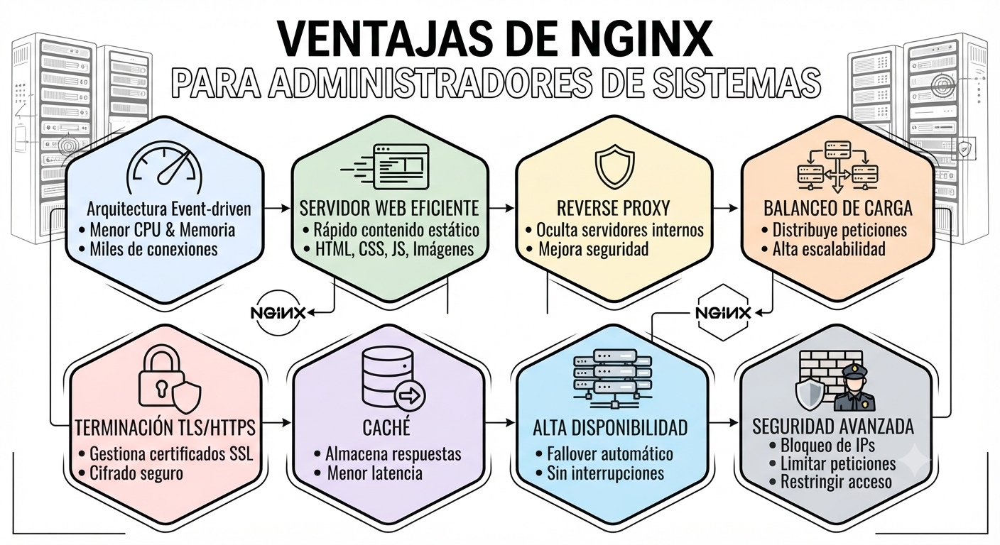

1. Alto rendimiento

    Nginx utiliza una arquitectura basada en eventos (event-driven) en lugar de crear un proceso o hilo por conexión:
    - Menor consumo de memoria
    - Menor uso de CPU
    - Capacidad para gestionar miles de conexiones simultáneas

2. Servidor web eficiente

    Es muy rápido sirviendo contenido estático:
    - HTML
    - CSS
    - JavaScript
    - Imágenes
    - Vídeos
3. Reverse Proxy (Proxy Inverso)

    Cliente -> Nginx -> Aplicación Web

    - Oculta los servidores internos
    - Mejora la seguridad
    - Centraliza la configuración web

4. Balanceo de carga (Load Balancing)

    Distribuye peticiones entre varios servidores.

5. Terminación TLS / HTTPS

    Gestiona los certificados SSL/TLS.

6. Caché

    Puede almacenar respuestas en memoria o disco.

7. Alta disponibilidad

    Si un servidor backend falla, Nginx puede dejar de enviar tráfico al servidor problemático.

8. Seguridad

    Permite:
    - Limitar peticiones
    - Bloquear IPs
    - Restringir acceso
    - Ocultar servidores internos

## Estructura básica de directorios de Nginx

Cuando instalas Nginx en Linux, los directorios más importantes suelen ser:

```
/etc/nginx/                Configuración de Nginx
/usr/share/nginx/html/     Sitio web por defecto
/var/log/nginx/            Logs
```


### /etc/nginx/ → Configuración

Aquí se guardan los archivos de configuración.

Ejemplos:

```bash
/etc/nginx/
|
├── nginx.conf
├── conf.d/
├── sites-available/
└── sites-enabled/
```

### /usr/share/nginx/html/ → Archivos web

Es la ubicación por defecto del sitio web en muchas instalaciones y en la imagen oficial de Docker.

/var/www/ → Sitios web personalizados. Muy común en servidores Linux.

### /var/log/nginx/ → Logs

Contiene los registros de actividad.

```
/var/log/nginx/
|
├── access.log
└── error.log
```

### Resumen para Administradores
```
/etc/nginx/
    Configuración

/usr/share/nginx/html/
    Página web por defecto

/var/www/
    Sitios web personalizados

/var/log/nginx/
    Logs
```

## Practica
En tu PC usando Visual Studio Code, 

```
mkdir nginx-demo
cd nginx-demo
```

Y crear el primer archivo de HTML en este mismo directorio.

```html
<!DOCTYPE html>
<html>
<head>
    <title>Hello World</title>
</head>
<body>
    <h1>Hello from Nginx in Docker!</h1>
</body>
</html>
```

Ahora, creamos un Dockerfile:

```
FROM nginx:latest

COPY index.html /usr/share/nginx/html/index.html
```

Y construimos (build) en la imagen de nginx, basado en el Dockerfile. Fijate que el comando termino en punto.

```
docker build -t my-nginx .
```

Vamos a mount el volumen, para poder modificar el html, ya que estamos en la fase de desarrollo:

```bash
docker run -d  -p 8080:80 -v "$(pwd)/index.html:/usr/share/nginx/html/index.html"  nginx
```

Si queremos montar el directorio entero, cambiar el volumen a: 
```
-v "$(pwd)/html:/usr/share/nginx/html"
```

Otra opcion, más cerca a la fase de producción, seria lo siguiente, sin poder modificar los archivos:

```bash
docker run -d --name my-webserver  -p 8080:80 my-nginx
```

http://localhost:8080 o curl http://localhost:8080 desde tu PC local

Ahora, ¿qué ocurre si modifico el archivo index.html en mi PC local?


Ahora, vamos a entrar en el contenedor de Docker de NGINX:

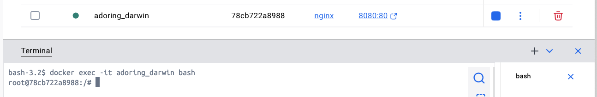

Fijáte donde esta ubicado el archivo de HTML. ¿Lo ves tambien en el Dockerfile?

```bash
cd /usr/share/nginx/html
ls
```

Ahora, desde fuera, fijate en los logs y procesos al ejecutar un GET

```
docker logs adoring_darwin
docker top adoring_darwin
```

## La analogía del restaurante

Imagina que diriges un restaurante con mucho trabajo.

Tienes un gerente (master process) que se encarga de las decisiones importantes:

Contratar personal
Gestionar inventario
Coordinar proveedores
Asegurarse de que todo funcione correctamente

Después tienes varios camareros (worker processes) que atienden directamente a los clientes.

El gerente no sirve mesas, sino que organiza todo para que los camareros puedan hacer su trabajo eficientemente.

Así funciona Nginx.

El proceso Master

El master process es como el gerente del restaurante.

Normalmente se inicia con permisos elevados (root) y se encarga de las tareas importantes:

Lee la configuración de Nginx
Comprueba que todo esté correctamente configurado.
Abre los puertos de red
Reserva los puertos HTTP y HTTPS:
Puerto 80 → HTTP
Puerto 443 → HTTPS
Gestiona los procesos worker
Los inicia, supervisa y los reinicia si fallan.
Gestiona señales del sistema
Responde a órdenes como:
Recargar configuración
Detener Nginx
Reiniciar procesos

El master process no atiende peticiones web directamente. Su función es coordinar y gestionar.

Los procesos Worker

Los worker processes son los que atienden a los usuarios.

Cada worker:

Procesa las peticiones web reales
Sirve páginas HTML, imágenes, archivos, etc.
Trabaja de forma independiente
Si un worker falla, los demás pueden seguir funcionando.
Gestiona muchas conexiones simultáneamente
Gracias al modelo basado en eventos de Nginx, un worker puede manejar miles de conexiones al mismo tiempo.
Tiene permisos limitados
Normalmente se ejecuta con un usuario como www-data por seguridad.
La ventaja del modelo de Nginx

La diferencia con servidores tradicionales es cómo manejan las conexiones.

Un servidor tradicional puede funcionar así:

Cliente 1 → Proceso nuevo
Cliente 2 → Proceso nuevo
Cliente 3 → Proceso nuevo
Cliente 4 → Proceso nuevo

Es como contratar un camarero nuevo para cada cliente.

Nginx funciona más como un camarero muy eficiente:

Worker Nginx
 |
 +-- Cliente 1
 +-- Cliente 2
 +-- Cliente 3
 +-- Cliente 4
 +-- Miles de conexiones

Un mismo worker puede atender muchas conexiones al mismo tiempo sin crear miles de procesos.

Resumen para un administrador de sistemas
Nginx

Master Process (root)
        |
        |
        +-- Worker Process (www-data)
        +-- Worker Process (www-data)
        +-- Worker Process (www-data)
        +-- Worker Process (www-data)
Master = administrador del servidor
Workers = empleados que atienden las peticiones
Master configura y controla
Workers sirven el contenido web


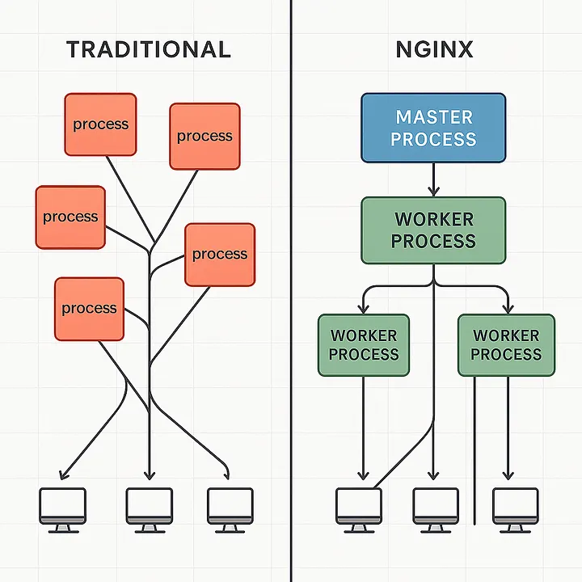


```
cat /etc/nginx/nginx.conf
```


Y vas a ver algo asi:
```
user nginx;

worker_processes auto;

error_log /var/log/nginx/error.log notice;
pid /var/run/nginx.pid;

events {
    worker_connections 1024;
}
```


Instalar nano para poder hacer modificaciones de los archivos de nginx de configuracion.

```
apt update
apt install -y nano
```

Modificar el config (/etc/nginx/nginx.conf) usando nano. Por ejemplo, nano nginx.conf.
Podemos cambiar el valoe de worker_processes auto; a worker_processes 1; y volvemos a ver si solo hay un worker trabajando, no múltiples.

Comprobar el archivo. Aqui estamos ejecutando el comando nginx:

```
docker exec adoring_darwin nginx -t
docker exec adoring_darwin nginx -s reload
```


y despues, mirar los procesos de nuevo:

docker top adoring_darwin 

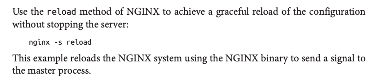


## Balanceadores de carga de Capa 4 (L4) vs Capa 7 (L7)

Un balanceador de carga distribuye las peticiones entre varios servidores para mejorar el rendimiento, la disponibilidad y la escalabilidad. Dependiendo de la capa del modelo OSI en la que opere, tendrá distintas capacidades.


| Característica | Capa 4 (L4)                             | Capa 7 (L7)                              |
| -------------- | --------------------------------------- | ---------------------------------------- |
| Capa OSI       | Transporte                              | Aplicación                               |
| Analiza        | Dirección IP, puerto, protocolo TCP/UDP | URL, cabeceras HTTP, cookies, parámetros |
| Velocidad      | Muy alta                                | Alta, pero con mayor procesamiento       |
| Inteligencia   | Baja                                    | Muy alta                                 |
| Uso habitual   | Servicios TCP/UDP y alto rendimiento    | Aplicaciones web, APIs y microservicios  |

### Balanceo de carga en Capa 4 (L4)

El balanceador toma decisiones utilizando únicamente información de red:

- Dirección IP de origen y destino.
- Puerto TCP o UDP.
- Protocolo utilizado.

No analiza el contenido de la petición, simplemente la reenvía al servidor seleccionado.

Ventajas:

- Muy rápido.
- Baja latencia.
- Poco consumo de CPU.
- Ideal para grandes volúmenes de tráfico y protocolos distintos de HTTP.

Limitaciones:

- No puede decidir el destino según la URL, las cookies o las cabeceras HTTP.
- Todos los servidores deben ofrecer prácticamente el mismo servicio.

### Balanceo de carga en Capa 7 (L7)


Trabaja sobre protocolos de aplicación como HTTP y HTTPS.

Antes de reenviar una petición, puede inspeccionar su contenido y decidir el destino según reglas configuradas.

Por ejemplo:

/api       → Servidores de API
/images    → Servidores de imágenes
/login     → Servidores de autenticación

También puede tomar decisiones según:

- URL.
- Cabeceras HTTP.
- Cookies.
- Idioma del usuario.
- Tipo de dispositivo.
- Versión de una API.

Ventajas:

- Enrutamiento inteligente.
- Ideal para arquitecturas de microservicios.
- Permite la terminación TLS (HTTPS).
- Facilita funciones como sesiones persistentes (sticky sessions), caché y políticas de seguridad.

Inconvenientes:

- Consume más CPU.
- Añade una pequeña latencia al tener que inspeccionar las peticiones.


## Logs

```
/var/log/nginx/
│
├── access.log
└── error.log
```

Fijate que los logs estan gestionados por Docker. Asi que hay que usar: docker logs adoring_darwin


Modificamos el config para agregar access_log y error_log, para hacer cambios en este web server solo, no en todos.

```
server {
    listen 80;
    server_name localhost;

    access_log /var/log/nginx/my-access.log;
    error_log /var/log/nginx/my-error.log;

    location / {
        root /usr/share/nginx/html;
        index index.html;
    }
}

```

Ahora, despues de test y reload, podemos ver los logs:

```
tail -f /var/log/nginx/my-access.log
```


## Autenticación

Usar el comando openssql passwd para crear un hash de la contraseña 'Secret123'
openssl passwd Secret123

El resultado lo guardamos en /etc/nginx/passwd archivo.

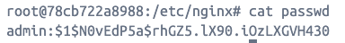

Ahora, vamos a modificar el default.conf archivo, especificando la ubicación del archivo passed.

/etc/nginx/conf.d/default.conf

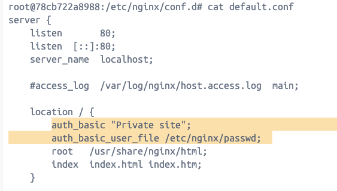

nginx -t
docker exec adoring_darwin nginx -s reload


echo "YWRtaW46U2VjcmV0MTIz" | base64 -d

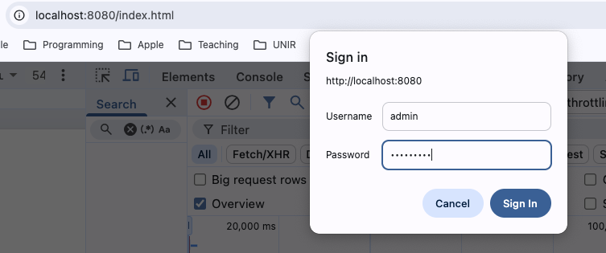
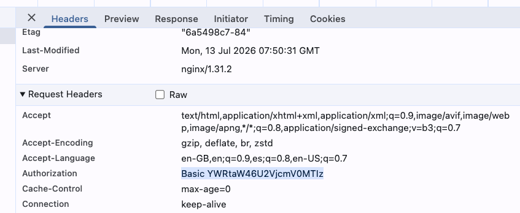


### Ejercicio: Proteger un área de administración con autenticación en Nginx

Hasta ahora hemos configurado un servidor web Nginx capaz de servir páginas HTML públicamente. En un entorno real, no todo el contenido de una aplicación debe estar disponible para todos los usuarios.

En este ejercicio vamos a crear una zona privada de administración dentro de nuestro sitio web. La página principal seguirá siendo accesible para cualquier usuario, pero el área /admin/ estará protegida mediante HTTP Basic Authentication de Nginx.

El objetivo es configurar Nginx para que:

- La página pública (/) pueda ser consultada por cualquier usuario.
- La carpeta /admin/ y su contenido solo sean accesibles mediante usuario y contraseña.
- Nginx valide las credenciales antes de permitir el acceso al contenido protegido.


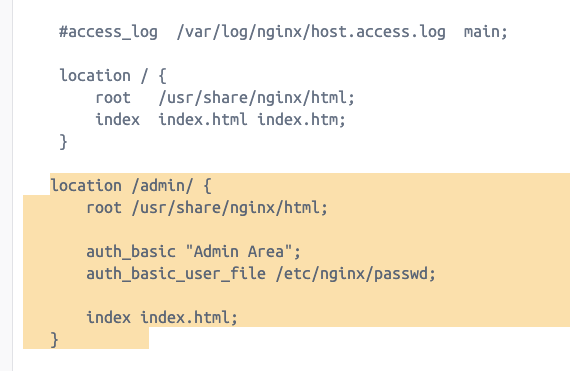


Comprobación final

Verificar que:

-  http://localhost:8080/ muestra la página pública sin pedir credenciales.
-  http://localhost:8080/admin/ solicita usuario y contraseña.
- Después de autenticarse correctamente, se puede acceder a la página de administración.


## Self-signed HTTPS certificate

Vamos a empezar con un nuevo contenedor, basado en la imagen original:

docker run -d --name nginx-https -p 443:443 -v "$(pwd)/index.html:/usr/share/nginx/html/index.html" nginx


Creamos un nuevo directorio 'certs' y ejecutamos el comando 'openssl genra' para crear una clave privada.

```
cd etc/nginx/certs  # usar mkdir para crearlo
openssl genrsa -out nginx.key 2048
```

Ahora, vamos a crear un certificado, contestando las preguntas como pais. 
Importante: Common Name (e.g. server FQDN or YOUR name): localhost

```
openssl req -new -x509 -key nginx.key -out nginx.crt -days 365
```

Comprobar el certificado:
```
openssl x509 -in nginx.crt -text -noout
```

Y modificamos el nginx confg con listen, ssl_certificate y ssl_certificate_key:

```
server {
    listen 443 ssl;

    ssl_certificate /etc/nginx/certs/nginx.crt;
    ssl_certificate_key /etc/nginx/certs/nginx.key;

    location / {
        root /usr/share/nginx/html;
        index index.html;
    }
}
```

Aunque la imagen muestra no secure, es por que algunos de las pruebas no han aprobado con éxito, ya que lo hemos hecho el certificado nosotros.

Browser checks:
   - Is the certificate valid? Si
   - Is it expired? No
   - Does the name match localhost? Si
   - Is it signed by a trusted Certificate Authority? NO => FAIL
(Certificate issuer: localhost, Certificate owner: localhost)

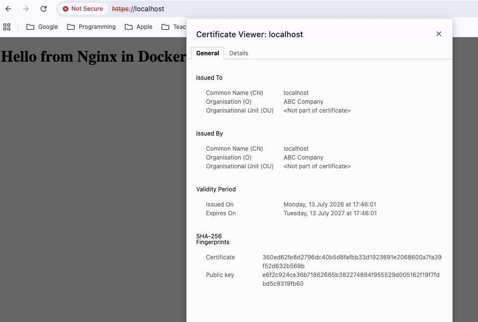


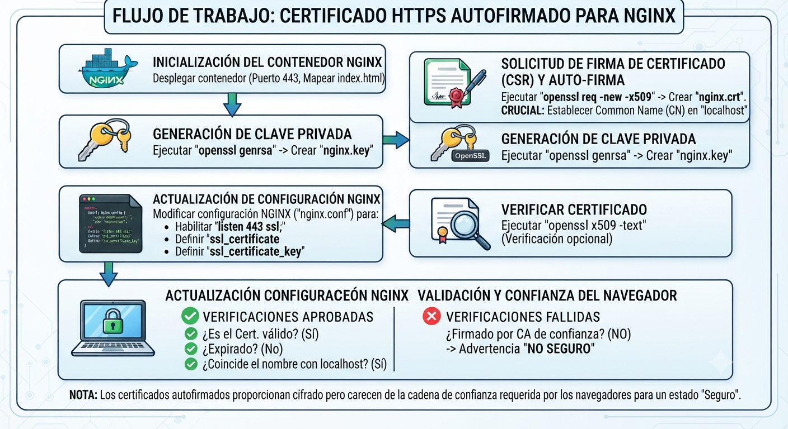


```
docker cp nginx-https:/etc/nginx/certs/nginx.crt ./nginx.crt
```


## Nginx reverse proxy


# Recursos
[Servidores Web en inglés - ventajas](https://www.youtube.com/watch?v=9nyiY-psbMs)
