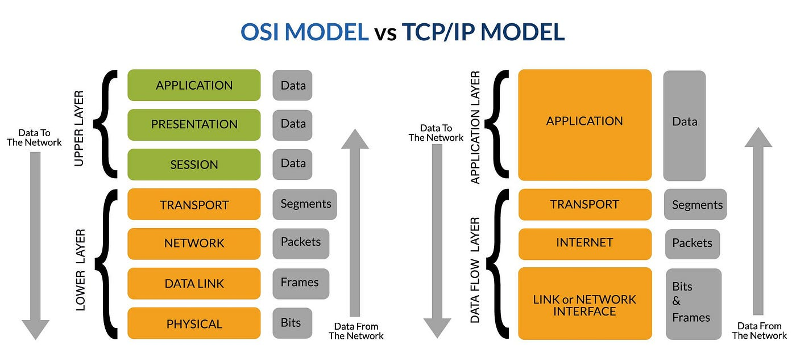
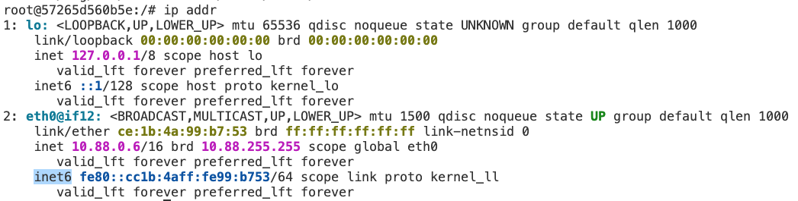
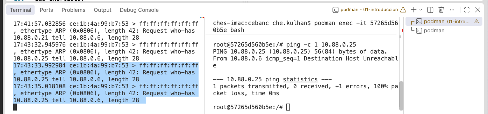
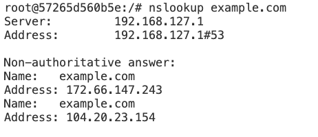

Encuentrar protocolos como http, telnet, https, ...

https://www.iana.org/assignments/service-names-port-numbers

Pensamos que las aplicaciones web estan relacionados con TCP//IP modelo:

┌─────────────────────────────┐
│       Web application       │
│     HTML / CSS / JS / API   │
├─────────────────────────────┤
│            HTTP             │
├─────────────────────────────┤
│         TCP / UDP           │
├─────────────────────────────┤
│             IP              │
├─────────────────────────────┤
│       Ethernet / Wi-Fi      │
└─────────────────────────────┘



Usar el Dockerfile en este directorio para crear y configurar una imagen de Ubuntu, pre-instalado con aplicaciones y herramientas:

```
FROM ubuntu:latest

ENV DEBIAN_FRONTEND=noninteractive

RUN apt-get update && apt-get install -y \
    iputils-ping \
    iproute2 \
    net-tools \
    dnsutils \
    traceroute \
    tcpdump \
    curl \
    netcat-openbsd \
    iptables \
    nano \
    && rm -rf /var/lib/apt-apt/lists/*

CMD ["/bin/bash"]
```

Build the Docker image - OJO! Hay un punto al final.

```
docker build -t ubuntu-network-lab .
```
y ejecutarlo con permisos para modificar "routing tables, IP addresses, and firewall rules inside the container":

```
docker run -it --cap-add=NET_ADMIN --cap-add=NET_RAW --name tcp-lab ubuntu-network-lab
```




Comandos para ejecutar
ip addr  => Ves al loop-back (ping localhost, ping 127.0.0.1) y el virtual 'veth' eth0@if12:

Practicar con:

> ip route get 10.88.0.20
> ip route get 8.8.8.8

| Comando          | Modelo mental                                           |
| ---------------- | ------------------------------------------------------- |
| `ip addr`        | **«¿Quién soy?»**                                       |
| `ip route`       | **«¿Qué redes puedo alcanzar y por dónde?»**            |
| `ip route get X` | **«¿Qué ruta utilizaría exactamente para llegar a X?»** |


| Destination  | Interface | Gateway (router)?            |
| ------------ | --------- | ------------------- |
| `10.88.0.21` | `eth0`    | ❌ No — direct       |
| `8.8.8.8`    | `eth0`    | ✅ Yes — `10.88.0.1` |


-ip neigh (o arp -a) para descubrir el MAC address del Docker Gateway (router)

ip neigh pregunta: ¿Qué MAC tengo que utilizar para enviar los datos a este dispositivo de mi red local?


Podemos experimentar con ARP, para ver como manda un broadcast al network local para ver quien va dirigido los mensajes: 

> tcpdump -i eth0 -n -e arp

Ahora, abrir otro Terminal (2) con "docker exec -it 57265d560b5e bash". (sustituye el numero con el contenedor que tienes)

> ping -c 1 10.88.0.25

Y veremos los datos en el Terminal (1), ya que esta broadcasting via ARP para encontrar el MACid para IP 10.88.0.25 :

17:43:33.992984 ce:1b:4a:99:b7:53 > ff:ff:ff:ff:ff:ff, ethertype ARP (0x0806), length 42: Request who-has 10.88.0.25 tell 10.88.0.6, length 28
17:43:35.018108 ce:1b:4a:99:b7:53 > ff:ff:ff:ff:ff:ff, ethertype ARP (0x0806), length 42: Request who-has 10.88.0.25 tell 10.88.0.6, length 28


"ff:ff:ff:ff:ff:ff" - indicar a mandar a todos los devices en el network.




---

¿Qué ocurre desde que escribo https://example.com hasta que recibo la página web?

> nslookup example.com

¿A qué dirección IP corresponde? 

Ha preguntado el DNS Server (primer IP) y luego a contestado con el IPs de example.com



> ip route get 172.66.147.243

Your container
```text
10.88.0.6
     │
     │ eth0
     ▼
Gateway
10.88.0.1
     │
     │
     ▼
Internet
     │
     ▼
172.66.147.243
example.com
```

- "La IP nos indica dónde debe llegar finalmente el paquete. La MAC nos indica a dónde enviarlo dentro de la red local actual."

- "Si el destino está en otra red, el equipo envía el paquete a su puerta de enlace (gateway), que se encargará de reenviarlo hacia la red de destino."


Vamos a crear una aplicación web (servidor) de Python, y accederlo desde otro contenedor, haciendo un "curl http://localhost:8080". Eso muestra que no usa lo de DNS y simple. Podemos ver el archivo /etc/hosts para comprobar que localhost esta en la lista, asi que no va a salir de la red local.

Pistas:
- Crear un vnuevo archivo en /var/www/html que se llama index.html. Es donde se alojará los archivos del proyecto web. El index.html deberia contener el texto: <h1>Hello from my web server!</h1>
- Instalar python
- Ejecutar el servidor en el puerto 8080.
- Desde otro Terminal (2), hacer un curl para acceder al servidor web en puerto 8080.

Y podemos escuchar/esperar los puertos con:
> ss -lnt   

LISTEN = "estoy preparado para aceptar conexiones TCP en este puerto".

```text
10.88.0.6:8080
     ↑       ↑
     IP     puerto
```

## Respuestas

mkdir var ...

```
echo '<h1>Hello from my web server!</h1>' > index.html

apt update
apt install -y python3

python3 -m http.server 8080


docker exec -it 57265d560b5e bash
curl http://127.0.0.1:8080
```