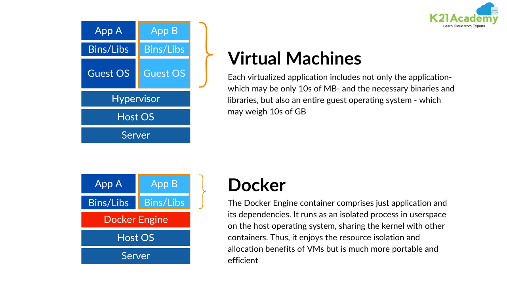

Más informacion sobre las diferencias:
https://k21academy.com/kubernetes/docker-vs-virtual-machine/

https://hub.docker.com/_/debian

docker run -it debian bash

cat etc/os-release
uname -a   # contiene el nombre del contenedor, y además, el host OS

TO DO - namespaces and cgroups for docker engine