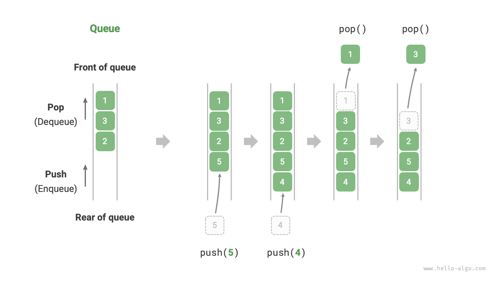

# Redis


## ¿Por qué Redis es tan rápido?

Redis almacena los datos directamente en la **memoria RAM**, en lugar de guardarlos en el disco duro. Al acceder a la memoria, el tiempo de respuesta es mucho menor que cuando es necesario leer información desde un dispositivo de almacenamiento.

### Tiempos aproximados de acceso

| Almacenamiento       |   Velocidad típica |
| -------------------- | -----------------: |
| Memoria RAM (Redis)  |  ~100 nanosegundos |
| Base de datos en SSD | ~100 microsegundos |
| Disco duro (HDD)     |   ~10 milisegundos |

Como puede observarse, el acceso a la memoria RAM es **cientos o incluso miles de veces más rápido** que el acceso al disco. Por este motivo, Redis es ideal para almacenar información que necesita consultarse con frecuencia, como datos en caché, sesiones de usuarios y colas de procesamiento, mejorando significativamente el rendimiento de las aplicaciones web.


```
docker compose exec redis redis-cli
```

y deberias ver el programa de Redis CLI, como 127.0.0.1:6379>

OJO: Confirmar que estas en el mismo directorio que el docker-compose archivo.

## Redis CLI
```
$ KEYS *

# Ejemplo respuesta
...
282) "_0b2a9a0bec12d1c6|notifications::Version"
283) "_0b2a9a0bec12d1c6|doctype_meta::DocType State"
284) "_0b2a9a0bec12d1c6|estimate_count::tabDocument Naming Rule"
285) "_0b2a9a0bec12d1c6|doctype_meta::Website Theme Ignore App"
286) "_0b2a9a0bec12d1c6|rl:lms.lms.utils.get_batches:192.168.65.1:3600"
287) "rq:job:lms.localhost||497d43b6-36de-4cb3-a465-c0ceeb628994"
288) "_0b2a9a0bec12d1c6|doctype_meta::Payment Country"
289) "rq:finished:home-frappe-frappe-bench:default"


GET "_0b2a9a0bec12d1c6|notifications::Version"

```

Ejemplo comandos para crear una clave y valor:

| Command  | Purpose          | Example               |
| -------- | ---------------- | --------------------- |
| `SET`    | Store a value    | `SET course "Docker"` |
| `GET`    | Retrieve a value | `GET course`          |
| `DEL`    | Delete a key     | `DEL course`          |
| `EXPIRE` | Set a lifetime   | `EXPIRE course 30`    |
| `KEYS`   | List stored keys | `KEYS *`              |

## Dificultades

GET "_0b2a9a0bec12d1c6|_user_settings"
(error) WRONGTYPE Operation against a key holding the wrong kind of value

Por defect, GET buscar un tipo de dato de STRING. Sin embargo, este clave es otra tipo de dato, como hash, list o set
127.0.0.1:6379> TYPE "_0b2a9a0bec12d1c6|_user_settings"

Usar el comando correcto para ver el valor de clave:

| Type     | Command                      |
| -------- | ---------------------------- |
| `string` | `GET key`                    |
| `hash`   | `HGETALL key`                |
| `list`   | `LRANGE key 0 -1`            |
| `set`    | `SMEMBERS key`               |
| `zset`   | `ZRANGE key 0 -1 WITHSCORES` |


## Queues (colas)

```
> KEYS rq:*

1) "rq:queues"
2) "rq:workers"
3) "rq:workers:home-frappe-frappe-bench:default"
4) "rq:worker:7ca291885145452bb0445762dd958dcd"
5) "rq:workers:home-frappe-frappe-bench:long"
6) "rq:workers:home-frappe-frappe-bench:short"
```





LPUSH myqueue "Task 1"
LPUSH myqueue "Task 2"

LRANGE myqueue 0 -1    # LRANGE <list> <start> <stop>  0 = first, -1 = last
LLEN myqueue    # numero de items 

RPOP myqueue # consumir los datos en la cola desde la derecha
LPOP myqueue # consumir los datos en la cola desde la izquierda

| Producer | Consumer | Behavior     |
| -------- | -------- | ------------ |
| `LPUSH`  | `RPOP`   | ✅ FIFO queue |
| `RPUSH`  | `LPOP`   | ✅ FIFO queue |
| `LPUSH`  | `LPOP`   | Stack (LIFO) |
| `RPUSH`  | `RPOP`   | Stack (LIFO) |


## FIFO y LIFO

Existen diferentes formas de organizar el procesamiento de datos o tareas. Dos de las más comunes son FIFO y LIFO.

### FIFO (First In, First Out)

FIFO significa "el primero en entrar es el primero en salir". Es el funcionamiento habitual de una cola.

Ejemplos:

- La cola de un supermercado.
- La fila de un banco.
- La cola de impresión de una impresora.

Si tres personas llegan en este orden:

Ana → Luis → Marta

Serán atendidas en el mismo orden:

Ana → Luis → Marta

### LIFO (Last In, First Out)

LIFO significa "el último en entrar es el primero en salir". Funciona como una pila de objetos.

Ejemplos:

- Una pila de platos.
- Una pila de libros.
- La función Deshacer (Undo) de muchos programas.

Si se apilan los platos en este orden:

Plato 1
Plato 2
Plato 3

El primero que se retira es el último colocado:

Plato 3
Plato 2
Plato 1

## FIFO y LIFO en Redis

Redis permite implementar ambos comportamientos utilizando listas.

### Ejemplo de una cola FIFO

Añadimos tres trabajos a la cola:

LPUSH pedidos "Pedido 1"
LPUSH pedidos "Pedido 2"
LPUSH pedidos "Pedido 3"

La cola queda así:

Izquierda                    Derecha
Pedido 3 | Pedido 2 | Pedido 1

Consumimos los trabajos con:

RPOP pedidos

Resultado:

"Pedido 1"

Los siguientes comandos devolverán:

"Pedido 2"
"Pedido 3"

El orden de procesamiento es:

Pedido 1 → Pedido 2 → Pedido 3

Es decir, el primero que entró es el primero que sale (FIFO).

### Ejemplo de una pila LIFO

Creamos la misma lista:

LPUSH pedidos "Pedido 1"
LPUSH pedidos "Pedido 2"
LPUSH pedidos "Pedido 3"

Pero ahora extraemos los elementos con:

LPOP pedidos

Resultado:

"Pedido 3"

Las siguientes extracciones devolverán:

"Pedido 2"
"Pedido 1"

El orden de procesamiento es:

Pedido 3 → Pedido 2 → Pedido 1

En este caso, el último que entró es el primero que sale (LIFO).


## Actividades 
Vamos a simular los pedidos de una tienda de soporte. Creamos una cola "soporte", y añade las incidencias:

- Crear una cola llamada soporte.
- Añadir las siguientes incidencias:
    - Instalar Microsoft Office.
    - Cambiar la contraseña de un usuario.
    - Configurar una impresora de red.
    - Actualizar el sistema operativo.

- Mostrar el contenido completo de la cola.
- Simular el trabajo del técnico, resolviendo las incidencias una a una.
- Comprobar que la cola queda vacía.


## Actividad: Sistema de gestión de pedidos de Globo

Una empresa de reparto de comida a domicilio opera en Donostia dividida en tres zonas: **Centro**, **Gros** y **Aiete**.

Cada vez que un cliente realiza un pedido, este debe ser gestionado por los repartidores de la zona correspondiente. El objetivo es que los pedidos se atiendan de forma ordenada y eficiente, evitando retrasos y permitiendo que cada zona trabaje de manera independiente.

Como administrador de sistemas, debes diseñar un mecanismo que permita organizar los pedidos utilizando Redis. La solución deberá facilitar la incorporación de nuevos pedidos, su procesamiento por parte de los repartidores y la consulta del estado de cada zona.

Una vez implementada la solución, deberás demostrar su funcionamiento mediante varios ejemplos y analizar las ventajas de este modelo de organización.

**Pregunta de reflexión**: Un viernes por la noche la zona Centro acumula 80 pedidos, mientras que Gros solo tiene 10. ¿Qué cambios propondrías en el sistema para reducir el tiempo de espera de los clientes? Justifica tu respuesta.