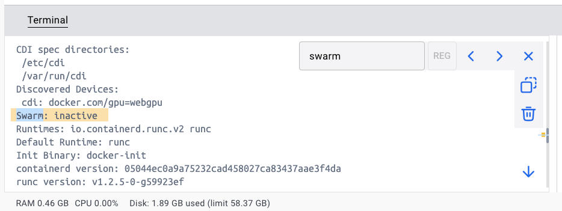
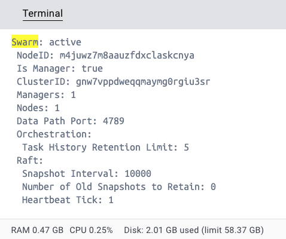
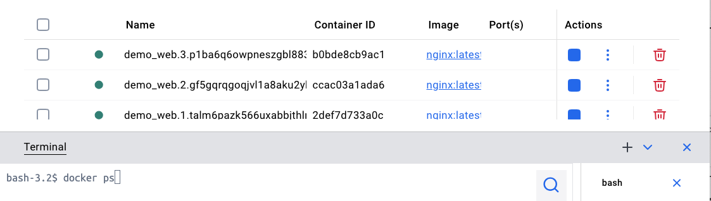

# Orchestracion
Diferentes opciones para orchestrar los contenedores:

https://profile.es/blog/comparativa-de-orquestadores-docker-swarm-vs-kubernetes-vs-apache-mesos/#:~:text=Apache%20Mesos%20es%20un%20administrador,gesti%C3%B3n%20y%20planificaci%C3%B3n%20de%20recursos.


# Swarm

Docker Swarm se basa en una arquitectura maestro-esclavo (manager-worker). Cada enjambre está formado al menos por un nodo maestro (también llamado administrador o manager) y tantos nodos esclavos (llamados trabajadores o workers) como se desee. El maestro de Swarm es responsable de la gestión del clúster y la delegación de tareas, el esclavo se encarga de ejecutar dichas tareas.

```
docker info
```

Verás que swarm esta instalado pero inactivo.



Vas a transformar un motor de Docker que funcionaba de forma aislada en el nodo principal (llamado Manager) de un clúster de servidores (llamado Swarm).

```
docker swarm init
```





```
docker node ls
```


Este comando no va a funcionar en la misma maquina, pero si hubiera más servidores, se contectará al cluster:

```
docker swarm join --token SWMTKN-1-xxxxx- 192.xxx.xxx.3:2377
```


Swarm has both nodes and services, but they represent different things.

A useful way to think about it is:

Nodes = Where work can run.
Services = What work should run.


docker stack deploy -c stack.yml demo

$ docker service ls

docker ps


¿Qué ocurre si borras uno e los contenedores?
¿Qué ocurre si cambias las replicas a replicas: 5 y despliegas de nuevo?  (docker stack deploy -c stack.yml demo)



Y para terminar, parecido a docker compose down:

```
docker stack rm demo
```


| Docker Compose         | Docker Swarm                            |
| ---------------------- | --------------------------------------- |
| `docker compose up -d` | `docker stack deploy -c stack.yml demo` |
| `docker compose ps`    | `docker service ls`                     |
| `docker compose down`  | `docker stack rm demo`                  |


## Resumen de la secuencia:

```
# Deploy the application
docker stack deploy -c stack.yml demo

# View the stack
docker stack ls

# View the services
docker service ls

# View the running tasks
docker stack ps demo

# Remove the entire application
docker stack rm demo
```

Compose: up → down
Swarm: deploy → rm


| **Número de réplicas/nodos** | **Beneficio**                                                                                                                                                                                  |
| ---------------------------- | ---------------------------------------------------------------------------------------------------------------------------------------------------------------------------------------------- |
| **1 réplica**                | La aplicación funciona correctamente, pero si el contenedor falla, habrá una breve interrupción del servicio mientras Docker Swarm crea y pone en marcha una nueva réplica.                    |
| **2 o más réplicas**         | La aplicación puede seguir atendiendo a los usuarios aunque una de las réplicas falle. Docker Swarm detecta el fallo y crea automáticamente una nueva réplica para mantener el número deseado. |
| **2 o más nodos**            | La aplicación también puede continuar funcionando si falla un servidor completo, ya que las réplicas pueden estar distribuidas entre distintos nodos del clúster.                              |

Idea clave: *Las réplicas* protegen frente al fallo de un contenedor, mientras que disponer de varios *nodos* protege frente al fallo de un servidor o máquina completa. Esta diferencia es uno de los conceptos fundamentales de la orquestación de contenedores y será la base para comprender posteriormente plataformas como Kubernetes.


## Deactivar Swarm

```
docker swarm leave --force  # force es obligatorio por que la máquina es el Manager
```

