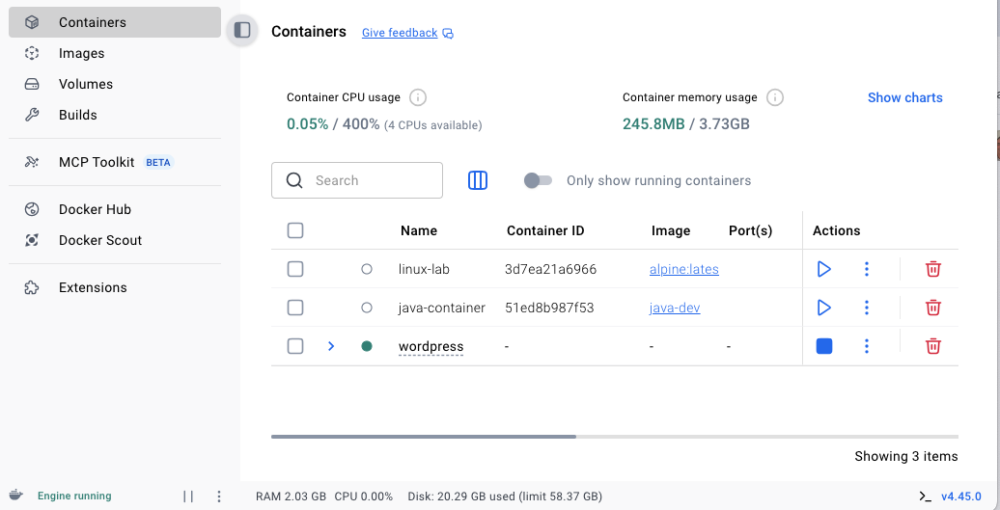
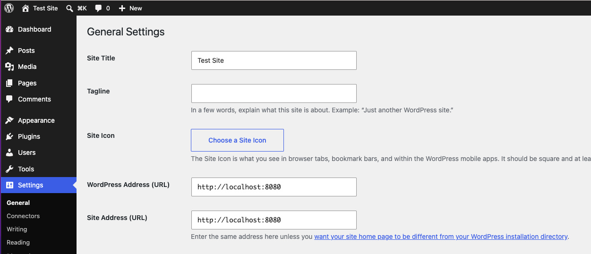
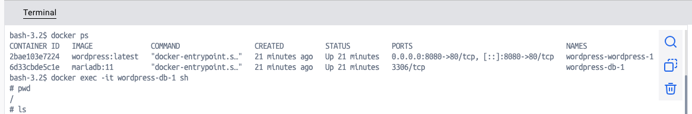
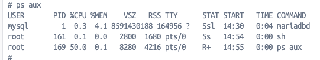
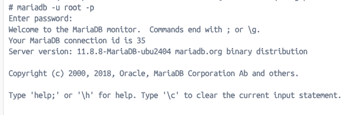
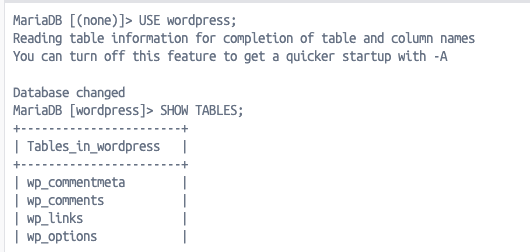
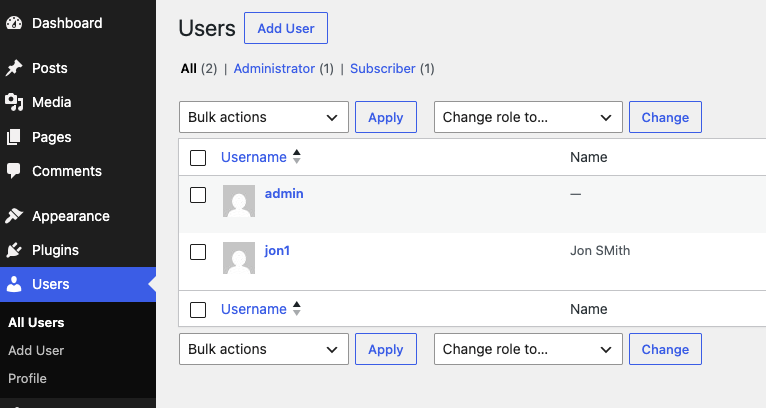

# Wordpress instalación

```bash
docker compose up -d
```



http://localhost:8080

Ahora, completar las configuraciones (contraseña, titulo, ...)

Posteriormente, se puede acceder y modificar en SETTINGS:



# Maria DB

Para acceder solamente al contenedor de Maria DB, la base de datos:

```bash
docker exec -it <db-container-name> sh
```






Recordar que la contraseña para MariaDB del root usuario esta en el docker compose: 

```yaml
environment:
      MYSQL_ROOT_PASSWORD: rootpassword
```



Ahora, podemos cambiar la base de datos a la usada por wordpress y ver las tablas:



y ejecutar comandos de SQL como

```sql
SELECT ID, user_login, user_email
FROM wp_users;
```

Y al introducir u nuevo usuario en la interfaz, deberia aparecer en la base de datos de tabla wp_users:



Para salir de Maria DB:

```sql
exit;
```

Para cerrar todo:
```bash
docker compose down
```


# Actividades
## Actividad 1
Echar un vistazo a este comando y a ver si eres capaz de añadir, a través de la UI, nuevos datos.

```sql
SELECT ID, post_title, post_status FROM wp_posts;
```

## Actividad 2

¿Cual es la diferencia entre los dos comandos, y qué muestran?

```sql
SELECT option_name, option_value FROM wp_options LIMIT 10\G;
SELECT option_name, option_value FROM wp_options LIMIT 10\G;
```

Encuentra la información en la UI


## Actividad 3

Salir de Maria DB contenedor, y ejecutar este comando. 
```
docker stop wordpress-db-1
```

Ahora, acceder a localhost:8080


¿Ahora qué vas a hacer?


# Respuestas
Actividad 3
docker ps -a
docker logs wordpress-db-1
docker start wordpress-db-1

OR
docker compose up -d db
docker compose up -d