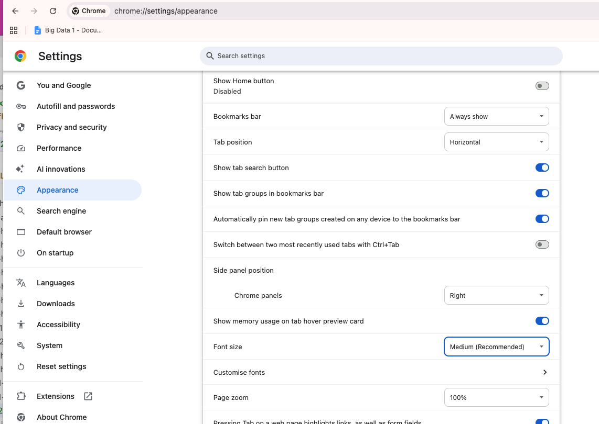

# Metadatos
Los metadatos (<meta>) son información sobre la página web que no se muestra directamente al usuario, pero que los navegadores, motores de búsqueda y otras herramientas utilizan.

Propósitos:

- Codificación de caracteres

- SEO (optimización en buscadores)

- Responsividad y diseño en móviles

- Información sobre el autor

- Iconos y recursos relacionados


 ```html
 <head>
    <meta charset="UTF-8">
    <meta name="description" content="Página sobre mi comida favorita, la pizza.">
    <meta name="keywords" content="pizza, comida, ingredientes, receta">
    <meta name="viewport" content="width=device-width, initial-scale=1.0">
    <meta name="author" content="Juan Pérez">
    <meta http-equiv="refresh" content="5">
    
    <link rel="icon" href="favicon.ico" type="image/x-icon">
</head>
```


# Refresh

Crear un página con un mensaje de "Under Maintenance". Después de 10 segundos, deberia redirigir el usuario a otra página:

```html
<meta http-equiv="refresh" content="X;url=https://example.com/home">
```

# Viewport

Primero, mostramos una página con y sin metadatos de viewport.

```css
div {
  height: 50%; /* 50% of parent element */
}

div {
  height: 50vh; /* 50% of the visible screen */
}
```

Segundo, jugamos con los valores de vh y vw. Creamos un div para mostrar el uso de vh (como porcentaje del viewport). Perfecto para landing pages.

¿Qué ocurre si quitas el margin y padding del body?

```css
body {
    margin:0;
    padding:0;
}
.box {
    height: 100vh; /* porcentaje */
    background-color: green;
}
```


# Charset
Unicode es un sistema de codificación universal que asigna un número único a cada carácter de todos los idiomas del mundo, incluyendo letras, símbolos, emojis, etc.

**UTF-8** es una forma de representar esos números (códigos Unicode) en bytes para que los ordenadores puedan almacenarlos y transmitirlos.

Características de UTF-8:

- Compatible con ASCII: los caracteres básicos de inglés usan 1 byte.

- Puede usar 1 a 4 bytes para representar cualquier carácter de cualquier idioma.

- Es el estándar más usado en la web porque permite mostrar texto multilingüe de forma confiable.

Ejemplo:

- Letra inglesa A → 1 byte en UTF-8

- Letra española ñ → 2 bytes en UTF-8

- Emoji 😀 → 4 bytes en UTF-8

```html
<!DOCTYPE html>
<html lang="en">
<head>
    <meta charset="UTF-8">  <!-- Cambiar a US-ASCII ve el resultado --> 
    <title>Chinese Charset Example</title>
</head>
<body>
   <p>你好！这是一个中文页面。</p>
    <p>一些中文字符：汉字，拼音，标点。</p>
</body>
</html>
```

## Actividades
### 1
Mostrar este texto con US-ASCII y luego correctamente:
```html
<p>Árboles, corazón, acción, difícil, próximo, inglés, niño, estación, música, reunión, pingüino, sofá, café.</p>
```

### 2 Con pseudo elements
Agregar un emoji antes y despues del Ongi Etorri 

```html
<!DOCTYPE html>
<html lang="ru">
<head>
    <meta charset="US-ASCII">
</head>

<style>
    /* pseudo elementos */
    .prefijo::before {
        content: "HELLO"
    }

</style>
<body>

<p class="prefijo">Ongi Etorri</p>

</body>
</html>
```


# Open Graph Protocol
El Open Graph Protocol es un conjunto de etiquetas meta que permite controlar cómo se muestra el contenido de una página web al ser compartido en redes sociales, como Facebook, Twitter o LinkedIn. Estas etiquetas se incluyen en la sección <head> del HTML y definen el título, descripción, imagen, tipo de contenido y más. Desarrollado por **Facebook**.

Algunos ejemplos de etiquetas Open Graph son:

```html
<meta property="og:title" content="Título de la página">
<meta property="og:description" content="Descripción breve del contenido">
<meta property="og:image" content="URL de la imagen">
<meta property="og:type" content="Tipo de contenido, como 'article'">
```

Twitter

```html
<meta name="twitter:card" content="summary_large_image">
<meta name="twitter:title" content="Mi página de pizza">
<meta name="twitter:description" content="Descubre mi receta favorita de pizza.">
<meta name="twitter:image" content="pizza.jpg">
```
Estas etiquetas mejoran la presentación del contenido cuando se comparte en redes sociales, lo que puede aumentar la visibilidad y el compromiso con el contenido.

Probar con Facebook: https://developers.facebook.com/tools/debug/. (solo funciona si tenemos un servidor!)

[Meta Tags para redes sociales](https://metatags.io/) 

[Google Search Central](https://developers.google.com/search) - más información para ayudar un SEO y Desarrollador/a


# robots.txt

Un archivo de texto plano ubicado en la raíz de tu sitio web (https://example.com/robots.txt).
Indica a los motores de búsqueda y rastreadores qué páginas pueden o no ser indexadas.

```
User-agent: *
Disallow: /private/
Allow: /public/
Sitemap: https://example.com/sitemap.xml
```

Buscar en internet una forma de bloquear ChatGPT a través del uso de robots.txt


# sitemap.xml
Un sitemap (o “mapa del sitio”) es un archivo que enumera todas las páginas importantes de un sitio web y proporciona información adicional sobre ellas, ayundando a los motores de búsqueda (como Google, Bing, etc.) a descubrir y entender tu sitio.

https://www.mysitemapgenerator.com/

```xml
<?xml version="1.0" encoding="UTF-8"?>
<urlset xmlns="https://www.sitemaps.org/schemas/sitemap/0.9">
  
  <url>
    <loc>https://example.com/</loc>
    <lastmod>2025-11-19</lastmod>
    <changefreq>daily</changefreq>
    <priority>1.0</priority>
  </url>

  <url>
    <loc>https://example.com/about</loc>
    <lastmod>2025-11-10</lastmod>
    <changefreq>monthly</changefreq>
    <priority>0.8</priority>
  </url>

</urlset>
```


# JSON-Ld
JSON-LD (JavaScript Object Notation for Linked Data) es un formato que permite añadir datos estructurados a una página web usando JavaScript, sin alterar el contenido visible para los usuarios.

Objetivo: Que motores de búsqueda y sistemas de IA puedan entender mejor el contenido de tu página.

Se usa mucho junto con Schema.org para describir tipos de contenido: recetas, productos, eventos, artículos, FAQs, etc.


“@type”, like Article, Recipe, Event, Product, FAQPage.


```js
<script type="application/ld+json">
{
  "@context": "https://schema.org",
  "@type": "Recipe",
  "name": "Pizza Casera",
  "author": {
    "@type": "Person",
    "name": "Juan Pérez"
  },
  "description": "Receta sencilla para hacer pizza casera deliciosa",
  "image": "https://example.com/pizza.jpg",
  "recipeIngredient": [
    "Harina",
    "Levadura",
    "Tomate",
    "Queso"
  ],
  "recipeInstructions": [
    "Mezclar ingredientes",
    "Amasar",
    "Hornear"
  ]
}
</script>
```

Ejemplos y más información: https://developers.google.com/search/docs/appearance/structured-data/sd-policies


# Rem y px

Fijate en los settings de Chrome

chrome://settings/appearance



Diferencia entre px y rem en CSS
- px (píxeles): unidad de medida fija. Por ejemplo, font-size: 16px establece un tamaño de fuente de 16 píxeles CSS.
- rem (root em): unidad relativa al tamaño de fuente del elemento raíz (html). Por defecto, suele ser 16px en los navegadores.

```css
html {
  font-size: 16px;
}

h1 {
  font-size: 2rem;  /* 32px */
}

p {
  font-size: 0.5rem;  /* 16px */
}

div {
  border: 1px solid black;
}
```