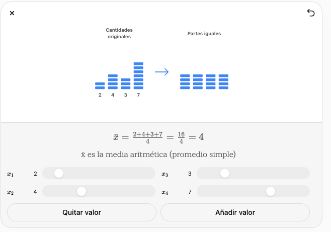
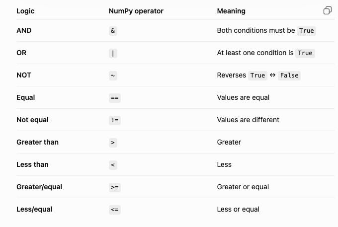

# Introducción a Notebooks con Numpy
Objetivo: Vamos a usar Google Colab y además, una versión de Jupyer con Docker.

```
docker run -it --rm -p 8888:8888 jupyter/scipy-notebook
```

y copiar el URL en el navegador.

¿En qué casos usaria Docker (con Jupyter) y qué casos usaria Colab (en la nube) 

```python
import numpy as np

a = np.array([1, 5, 6, 7])
c = np.array([True, True, False])
b = np.array([[1, 2, 3], 
    [4, 5, 6]])


print(a)
print(b)
print(a.shape)
print(b.dtype)

# tipos de datos
c = np.array([1, 5, 7], dtype=np.int8)

# Acceso a elementos
a[0]
a[-1]
a[::2] # Stepping: [start:stop:step]

matrix = np.array([
    [10, 20, 30],  # Row 0
    [40, 50, 60],  # Row 1
    [70, 80, 90]   # Row 2
])

matrix[1, 2]
matrix[1, :] # fila completa
```

## Generación de valores
np.arange([start,] stop[, step,], dtype=None)

```
x = np.arange(5, 100, 2)
a = np.linspace(0, 1, num=5)
```
## Valores aleatorios
```
rng = np.random.default_rng(seed=42)

rng.random()
rng.random(5)
rng.random((2,4))
```

¿Qué otras opciones tenemos para valores aleatorias?
```
options = np.array(['Red', 'Green', 'Blue', 'Yellow'])
rng.choice(options)

numbers = np.array([1, 2, 3, 4, 5])
rng.shuffle(numbers) # aleatoriamente cambiamos el mismo matriz
print(numbers)

```

# Actividad
## 1 Casino
Usando rng.integers(), queremos simular el tiro de dados en un casino. Hay mucha, mucha gente en el casino, tirando dados continuamente.

Encuentra **la media aritmética (promedio)**, minimo, maximo (obviamente 1 y 6) de los tiros de dados.

## 2 Promedio

¿Puedes simular la imagen con numpy?




# Matemáticas Booleano

With NumPy arrays, use & and |, not Python's and and or.

```
numeros = np.array([1, 2, 3, 4, 5, 6])

filters = numeros > 4
print(filters)
numbers[numbers > 3]

result = numbers[(numbers > 2) & (numbers < 5)]
result

names = np.array(["Ana", "Luis", "Carlos", "Marta"])
result = names[names == "Ana"]


```




## Actividad

Crea un array con muchos datos de notas de los alumnos en los examenes (0 a 100) y obtener:

- Todas las puntuaciones mayores que 70.
- Todas las puntuaciones menores que 40.
- Todas las puntuaciones mayores o iguales que 80.
- Todas las puntuaciones menores o iguales que 50.
- Todas las puntuaciones iguales a 100.
- Todas las puntuaciones diferentes de 55.

- Puntuaciones mayores que 50 Y menores que 80.
- Puntuaciones mayores o iguales que 60 Y menores o iguales que 90.

- Puntuaciones menores que 30 O mayores que 90.
- Puntuaciones menores que 40 O mayores que 80.

- Obtén todas las puntuaciones que NO sean mayores que 70.
- Obtén todas las puntuaciones que NO sean menores que 50.

# Respuestas

```
tiradas = rng.integers(low=1, high=7, size=10)
tiradas
tiradas.max()
tiradas.mean()
```

