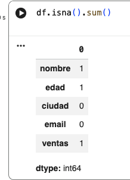
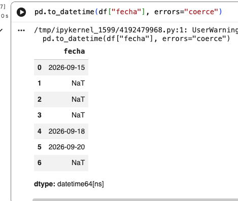
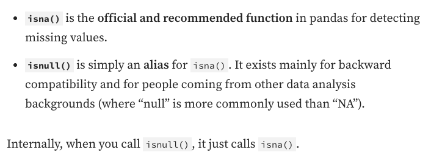

```csv
import pandas as pd

df = pd.DataFrame({
    "nombre": ["Ana", "Luis", "Marta", "Ana", "Jon", None, "Ana"],
    "edad": [23, 35, None, 23, 150, 28, 23],
    "ciudad": ["Donostia", "Bilbao", "donostia ", "Donostia", "Bilbao", "Vitoria    ", "Donostia"],
    "email": ["ana@mail.com", "luis@mail.com", "marta@mail.com",
              "ana@mail.com", "jon@mail.com", "incorrecto", "ana@mail.com"],
    "ventas": [1200, 850, 900, 1200, -50, None, 1200],
    "fecha": ["15/09/2026", "2026-09-16", "17-09-2026",
              "31/02/2026", "18/09/2026", "20/09/2026", "2026/09/21"]
})

df
```


| Qué buscamos                  | Ejemplo en ventas                   | Pandas                       |
| ----------------------------- | ----------------------------------- | ---------------------------- |
| **Valores nulos**             | `unidades = NaN`                    | `isna()`                     |
| **Duplicados**                | misma venta repetida                | `duplicated()`               |
| **Valores fuera de rango**    | `unidades = -2` o `200`             | filtros                      |
| **Tipos incorrectos**         | `unidades = "abc"`                  | `to_numeric()`               |
| **Valores inconsistentes**    | `Informática` / `Informatica`       | `unique()`, `replace()`      |
| **Texto inconsistente**       | `Teclado` / `teclado`               | `str.lower()`, `str.strip()` |
| **Valores no válidos**        | categoría `"XXX"`                   | `unique()`, filtros          |
| **Formatos incorrectos**      | fechas como texto o mal escritas    | `to_datetime()`              |
| **Columnas innecesarias**     | información que no necesitamos      | `drop()`                     |
| **Datos que no corresponden** | precio negativo, ciudad desconocida | filtros/reglas               |

1. ¿Faltan datos?              → Nulos
2. ¿Hay datos repetidos?       → Duplicados
3. ¿Los valores tienen sentido?→ Fuera de rango
4. ¿Son del tipo correcto?     → Tipos de datos
5. ¿Están escritos igual?      → Consistencia
6. ¿La información es válida?   → Reglas de negocio

```
df.head()

df.info()
df.describe()

# Nulos
df.isna().sum()
df2 = df.dropna() # quitar FILAS con nulos
df2 = df.dropna(axis="columns") # quitar COLUMNAS con nulos
```



# Rellenar datos sin valores (None o nulo)
```
df.fillna("ABCD")
df["ventas"].fillna("ABC")

df["ventas"] = df["ventas"].fillna(df["ventas"].median())
```

# Filas Duplicadas
```
df.duplicated()
df.duplicated().sum()
df[df.duplicated()]
df[~df.duplicated()]
df.duplicated(keep="last")
df.duplicated(subset=["edad"]) # buscar por la columna
df2 = df.drop_duplicates()
```

# Detectar valores invalidos (fuera del rango)
```
df["edad"]>100
df.loc[df["edad"] > 100]
df.loc[df["edad"]>100, "edad"] = df["edad"].median()
```

# Limpieza de Texto
```
 "A" + df["ciudad"].str.strip() + "A"
df["ciudad"] = df["ciudad"].str.strip()

df["ciudad"].str.upper()
df["email"].str.contains("@")
df2 = df[df["email"].str.contains("@")] # borrar la fila que no contenga @
```


# Fechas
`errors="coerce"` es útil ya que la fecha inválida se convierte en NaT

```
pd.to_datetime(df["fecha"], errors="coerce")
df["fecha"] = pd.to_datetime(df["fecha"], errors="coerce")

df.dropna(subset = "fecha")
```







# Actividad

!Te toca!

```
import pandas as pd

df = pd.DataFrame({
    "propietario": [
        "  Iker ", "MARIA", "Ane", "Jon ", "  Iker ", "Unai", None, "Nerea"
    ],
    "localidad": [
        "donostia", "BILBAO ", " Donostia ", "bilbao", "donostia",
        "Vitoria-Gasteiz", "vitoria-gasteiz ", "Bilbao"
    ],
    "email": [
        "iker@mail.com", "maria@mail.com", "ane@mail.com", "jonmail.com",
        "iker@mail.com", "unai@mail.com", "incorrecto", "nerea@mail.com"
    ],
    "superficie_m2": [
        "85", "72", "veintidós", "110", "85", "65", "3500", None
    ],
    "cuota_mensual": [
        "125.50", "85.00", "90", "120", "125.50", "75", "abc", None
    ],
    "fecha_ultimo_pago": [
        "15/09/2026", "2026-09-16", "17-09-2026", "31/02/2026",
        "15/09/2026", "20/09/2026", "2026/09/21", "22/09/2026"
    ]
})

df
```