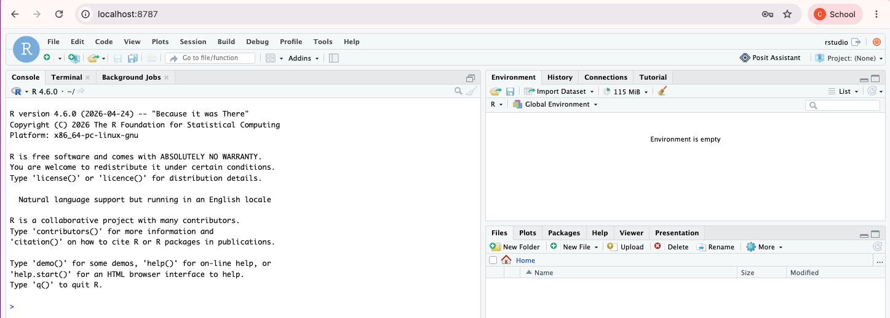

# RStudio usando Docker

**RStudio Server** es una aplicación de software que permite ejecutar la versión del entorno de desarrollo integrado (IDE) de R en un navegador web. Facilita el análisis estadístico, la visualización de datos y el desarrollo de aplicaciones usando R en entornos multiusuario y servidores remotos.


```bash
docker run --rm -it  -p 8787:8787  -e PASSWORD=mysecretpassword  rocker/rstudio
```

Acceder desde le navegador:

http://localhost:8787


username: rstudio

password: mysecretpassword




