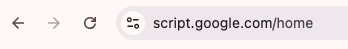
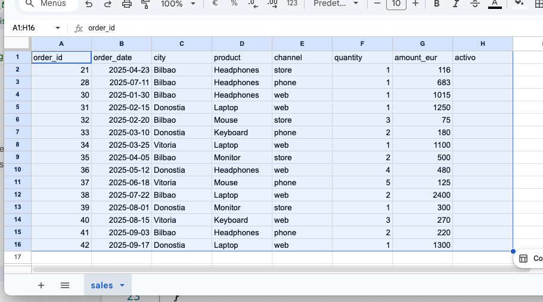
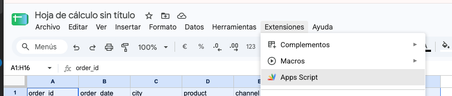
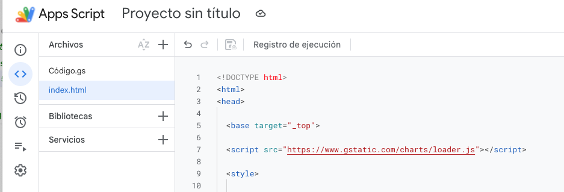

# Google Apps Script

https://developers.googleblog.com/get-ready-to-up-your-apps-script/




Google Apps Script es una plataforma de Google basada en JavaScript que permite automatizar y ampliar servicios de Google como Sheets, Drive, Gmail, Forms o Calendar, además de crear pequeñas aplicaciones web.

Su evolución se puede resumir así:

- 2009: Google presenta Apps Script como una forma sencilla de programar sobre Google Apps.
- Años 2010: se amplía su integración con los servicios de Google y se convierte en una herramienta habitual para automatización y pequeñas aplicaciones.
- Posteriormente: incorpora más servicios y APIs, permitiendo trabajar también con servicios de Google Cloud, como BigQuery.
- Actualmente: permite crear desde simples automatizaciones de una hoja de cálculo hasta web apps y dashboards, utilizando JavaScript tanto en el servidor como en el navegador.

Una forma sencilla de entender su evolución sería:

Google Sheets → Automatización → Integración entre servicios → APIs/Cloud → Aplicaciones web y dashboards


> Sheets.new

Pegar estos datos en la hoja de Sheets.

```csv
order_id	order_date	city	product	channel	quantity	amount_eur	activo
21	2025-04-23	Bilbao	Headphones	store	1	116	
28	2025-07-11	Bilbao	Headphones	phone	1	683	
30	2025-01-30	Bilbao	Headphones	web	1	1015	
31	2025-02-15	Donostia	Laptop	web	1	1250	
32	2025-02-20	Bilbao	Mouse	store	3	75	
33	2025-03-10	Donostia	Keyboard	phone	2	180	
34	2025-03-25	Vitoria	Laptop	web	1	1100	
35	2025-04-05	Bilbao	Monitor	store	2	500	
36	2025-05-12	Donostia	Headphones	web	4	480	
37	2025-06-18	Vitoria	Mouse	phone	5	125	
38	2025-07-22	Bilbao	Laptop	web	2	2400	
39	2025-08-01	Donostia	Monitor	store	1	300	
40	2025-08-15	Vitoria	Keyboard	web	3	270	
41	2025-09-03	Bilbao	Headphones	phone	2	220	
42	2025-09-17	Donostia	Laptop	web	1	1300	
```










