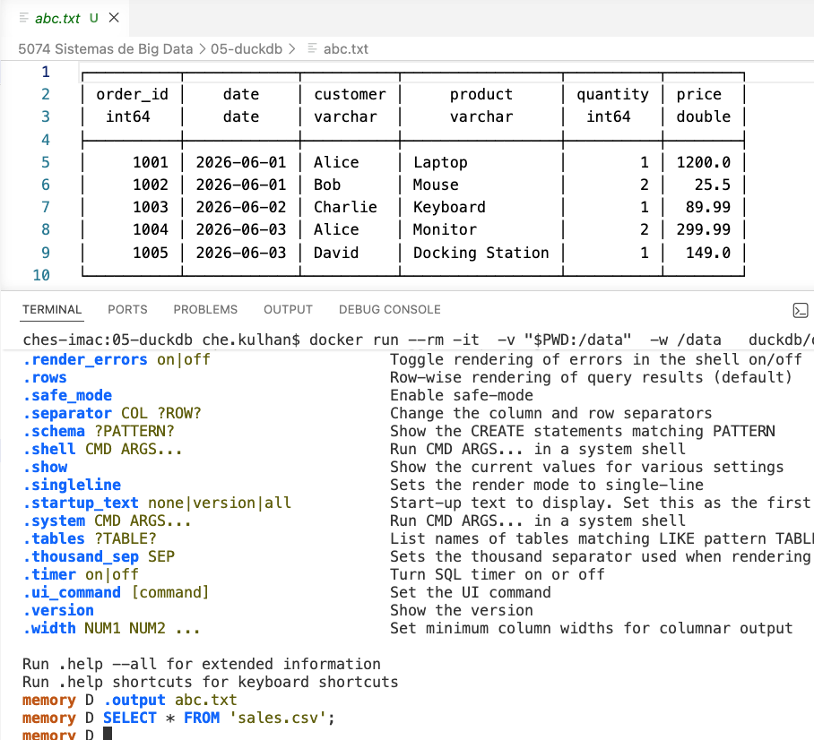
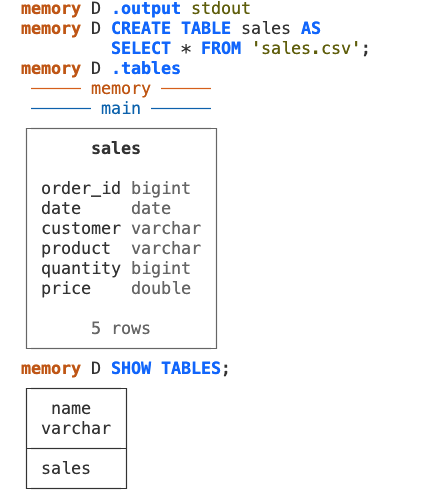
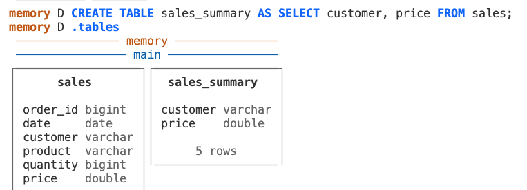
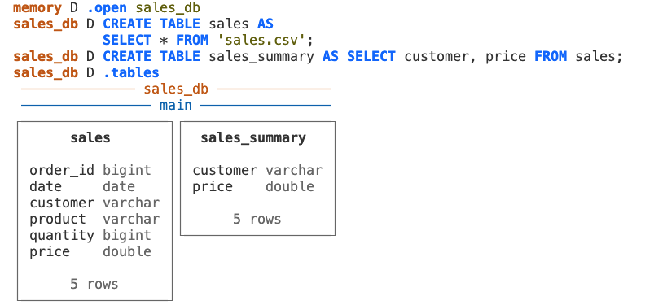
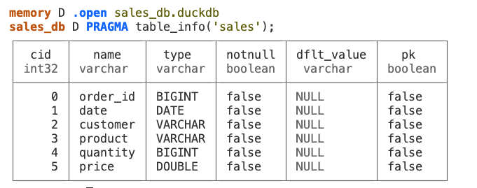

# Docker con DuckDB CLI

```bash
docker run --rm -it  -v "$PWD:/data"  -w /data   duckdb/duckdb
```
Al crear el contenedor, el directorio actual esta enlazado con el contenedor de duckdb. Por tanto, poniendo un archivo CSV o texto en este directorio, es capaz de leer (ingerir) los datos.

Vamos a incluir un archivo de sales.csv en el directorio actual, y desde el CLI de DuckDB, podemos ingerir los datos:




## dot commands
.help
.output stdout
.quit

## SQL Commands

Podemos ingerir los datos y guardarlos en una tabla.

```sql
CREATE TABLE sales AS 
SELECT * FROM 'sales.csv';
```

OJO: No te olvides en cambiar el .output a stdout



Podemos empezar a hacer un poco de transformaciones a los datos, y exportarles en formatos diferentes:



```sql
COPY sales_summary TO 'sales_summary.txt';
```
## Databases



Deberias crear la base de datos con extension *.duckdb.

Fijaos que estamos ejecutando el CLI de duckdb y pasando como parámetro el nombre de la base de datos:

```bash
docker run --rm -it  -v "$PWD:/data"  -w /data  duckdb/duckdb /duckdb sales_db.duckdb 
```
o simplemente ejecutar el contenedor como siempre y posteriormente run:

```duckdb
.open sales_db.duckdb
```

## PRAGMA commandos
PRAGMA es un comando especial del motor de base de datos (no una herramienta separada) que permite consultar o modificar la configuración interna de la base de datos.

No se usa normalmente para trabajar con los datos, sino para obtener información del sistema o cambiar su comportamiento.

+--> PRAGMA commands
    PRAGMA database_list;
    PRAGMA version;
    PRAGMA enable_profiling;

