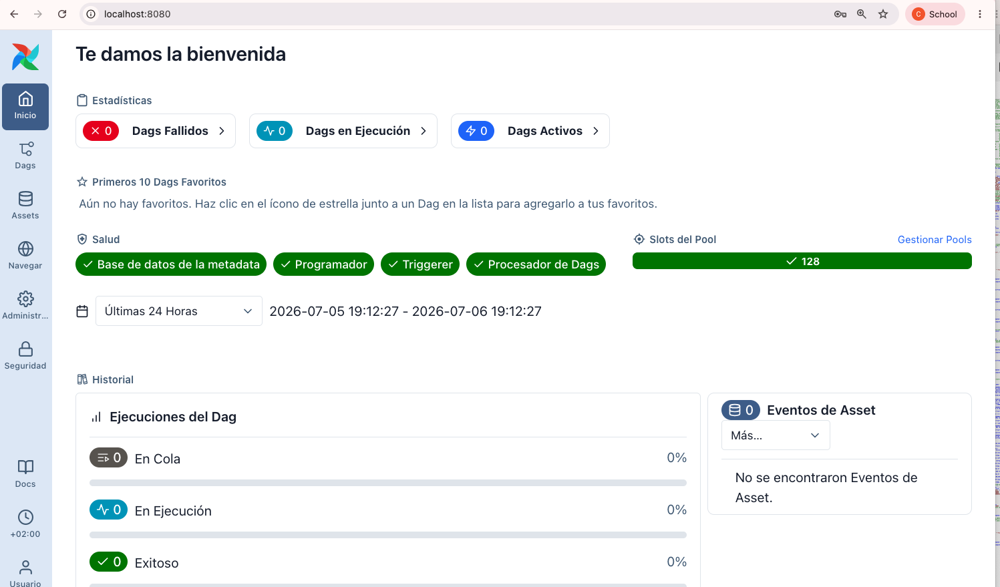
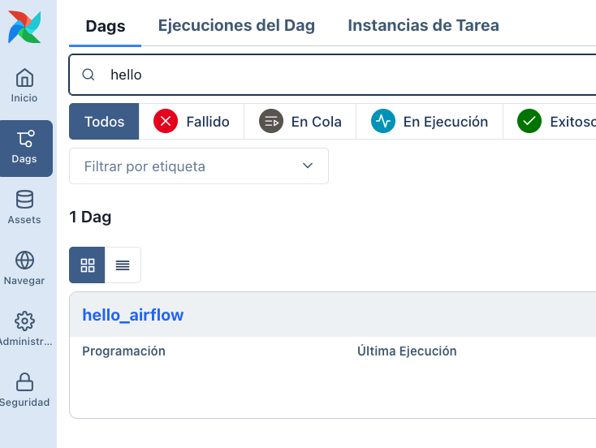
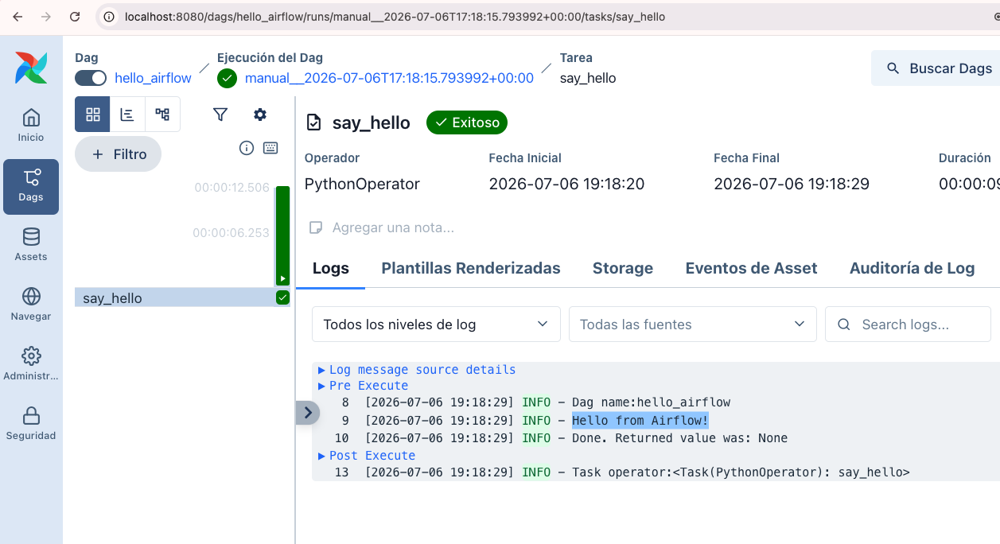
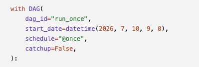
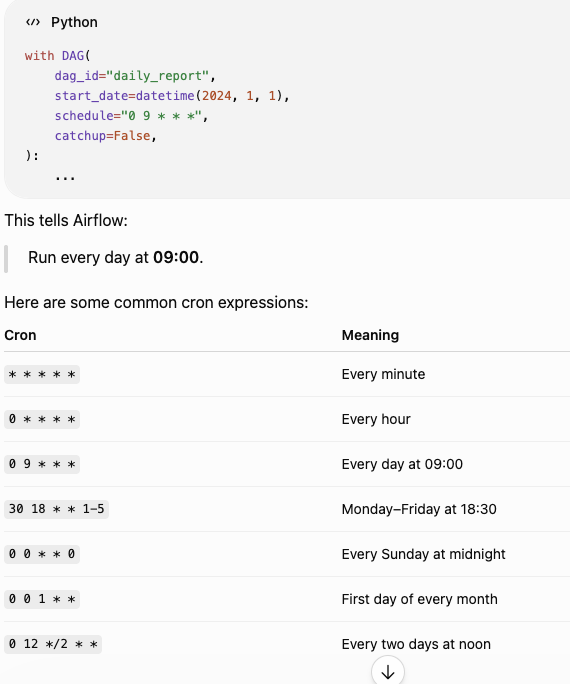
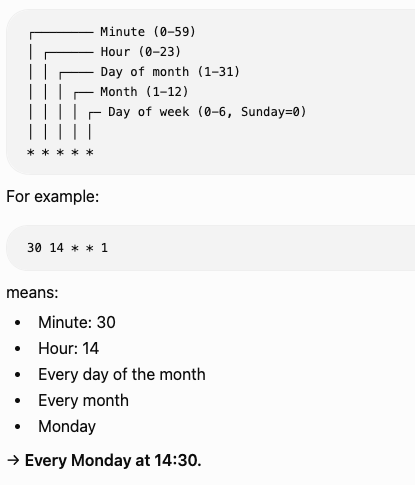
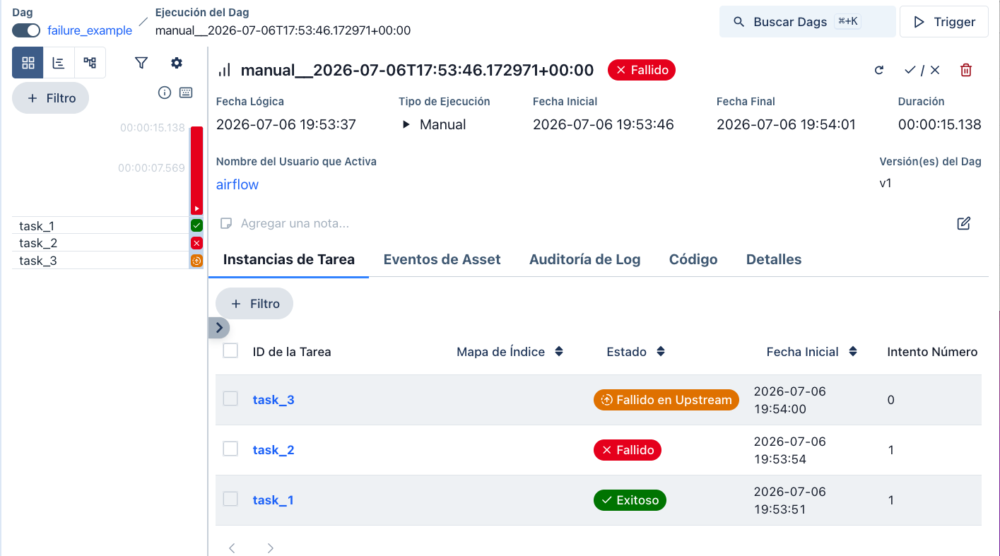

# Airflow
https://hub.docker.com/r/apache/airflow

## Paso 1

Descargar el docker compose oficial o usar lo que tengo aqui.

```bash
curl -LfO https://airflow.apache.org/docs/apache-airflow/stable/docker-compose.yaml
```

## Paso 2

Crear los directorios que necesita el docker compose. Fijáte antes en el contenido del archivo yaml.

```bash
mkdir -p dags logs plugins config
```
Ahora, la carpeta deberia aparecer como:

```bash
docker-compose.yaml
dags/
logs/
plugins/
config/
```

## Paso 3

Airflow UID. Por defecto, este linea user: "${AIRFLOW_UID:-50000}:0". va a coger el UID de Linux de 50000 por defecto.

- macOS y Windows (Docker Desktop): The official Airflow documentation typically recommends:
AIRFLOW_UID=50000

Crear un archivo .env con:

```bash
AIRFLOW_UID=50000
```
## Paso 4

Ahora, ejecutar docker compose para que cree todos los servicios y configuraciones necesarios:

```bash
docker compose up airflow-init
```

### ¿Qué esta pasando?
El contenedor **`airflow-init`** se inició, realizó las tareas de configuración inicial y, una vez finalizadas, se detuvo. Normalmente realiza las siguientes acciones:

* Crea la **base de datos de metadatos de Airflow** en PostgreSQL.
* Aplica todas las **migraciones de la base de datos** para que el esquema sea compatible con la versión de Airflow que estás utilizando.
* Crea la **cuenta de administrador predeterminada** (normalmente `airflow` / `airflow` en la configuración oficial con Docker Compose).
* Comprueba que los directorios necesarios (`dags`, `logs`, `plugins`, etc.) existen y que tienen los permisos adecuados.
* Finalmente, se detiene porque ya ha completado su función.

Puedes pensar en este proceso como la instalación de una aplicación por primera vez: ejecutas el **instalador** una sola vez y, a partir de ese momento, ya puedes ejecutar la aplicación normalmente.

## Paso 5

**Crear** el archivo hello_airflow.py en /dags directorio.

Esta enlazado con el Docker contenedor, asi que cualquier cambio en el directorio, se verá reflexjado en el contenedor de Arflow.

## Paso 6

Finalmente, ejecuta el comando para iniciar y arrancar todos los servicios:
```bash
docker compose up -d
```

### ¿Qué se está ejecutando realmente?

Cuando ejecutas `docker compose up -d`, se ponen en marcha varios contenedores que trabajan de forma coordinada:

* **PostgreSQL**: almacena los **metadatos de Airflow**, como las ejecuciones de los DAG, el historial de tareas, los usuarios, entre otros.
* **Redis**: se utiliza para la comunicación entre los distintos componentes de Airflow (dependiendo del *executor* configurado).
* **Scheduler**: supervisa continuamente la carpeta `dags/`, identifica qué flujos de trabajo deben ejecutarse y planifica la ejecución de sus tareas.
* **API Server / Web UI**: proporciona la interfaz web de Airflow y expone la API para interactuar con la plataforma.
* **Triggerer**: gestiona de forma eficiente las tareas diferidas (*deferred tasks*), optimizando el uso de recursos.
* **Workers** (si se utiliza el **Celery Executor**): son los encargados de ejecutar las tareas programadas por el Scheduler.

El **Scheduler** supervisa continuamente el contenido del directorio `dags/`. Cada vez que añades o modificas un archivo Python que contiene un DAG válido, Airflow lo detecta automáticamente y lo muestra en la interfaz web, sin necesidad de reiniciar los contenedores.


## Paso 7
y acceder a http://localhost:8080/

Username: airflow
Password: airflow




Ejecutar el codigo que hemos creado al principio:






### Tarea 1

Ahora, ejecutar este codigo:

```python
from airflow import DAG
from airflow.operators.python import PythonOperator
from datetime import datetime


def extract():
    print("Extracting data...")
    numbers = [1, 2, 3, 4, 5]
    print(numbers)


def transform():
    print("Transforming data...")
    squared = [1, 4, 9, 16, 25]
    print(squared)


with DAG(
    dag_id="two_tasks_example",
    start_date=datetime(2024, 1, 1),
    schedule=None,
    catchup=False,
) as dag:

    extract_task = PythonOperator(
        task_id="extract",
        python_callable=extract,
    )

    transform_task = PythonOperator(
        task_id="transform",
        python_callable=transform,
    )

    extract_task >> transform_task
```

### Tarea 2
```bash

           start
          /     \
         ▼       ▼
     task_a   task_b
         \       /
          ▼     ▼
            end
```

```python
from airflow import DAG
from airflow.operators.python import PythonOperator
from datetime import datetime


def task_a():
    print("Running Task A")


def task_b():
    print("Running Task B")


def end():
    print("Both tasks have finished!")


with DAG(
    dag_id="parallel_tasks_example",
    start_date=datetime(2024, 1, 1),
    schedule=None,
    catchup=False,
) as dag:

    task_a_operator = PythonOperator(
        task_id="task_a",
        python_callable=task_a,
    )

    task_b_operator = PythonOperator(
        task_id="task_b",
        python_callable=task_b,
    )

    end_task = PythonOperator(
        task_id="end",
        python_callable=end,
    )

    [task_a_operator, task_b_operator] >> end_task
```


## Avanzado

Para acceder a los archivos:
```bash
docker compose exec airflow-scheduler bash
```


Aplicar un horario:



o através de cron:






Y un ejemplo de fallo:




Para cerrar, usar:
```bash
docker compose down
```

y para **eliminar y empezar todo de nuevo**:
```bash
docker compose down -v
```