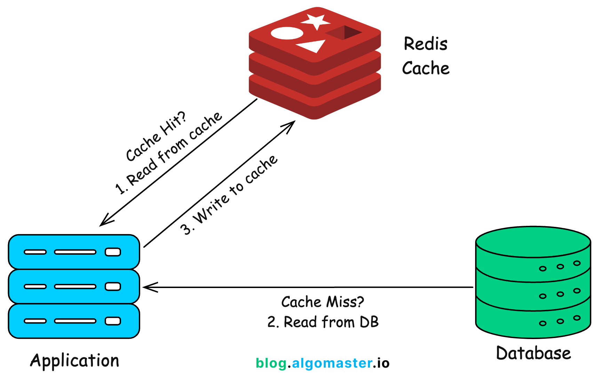

# Introducción a Redis



**Redis** (Remote Dictionary Server) es una **base de datos NoSQL en memoria (RAM)** de código abierto, diseñada para ofrecer un acceso extremadamente rápido a la información. A diferencia de las bases de datos tradicionales, Redis almacena los datos directamente en la memoria principal del ordenador, lo que permite responder a las consultas en milisegundos o incluso microsegundos.

Redis es ampliamente utilizado en aplicaciones web, plataformas de comercio electrónico, sistemas de inteligencia artificial y aplicaciones Big Data debido a su alto rendimiento y a la variedad de estructuras de datos que ofrece.

## Redis como base de datos NoSQL

Redis es una **base de datos de tipo clave-valor (Key-Value)**. Cada dato se almacena mediante una **clave (key)** que identifica un **valor (value)**.

Una de sus principales ventajas es que el valor puede adoptar diferentes estructuras de datos, como:

* Cadenas de texto (Strings).
* Listas (Lists).
* Hashes (objetos formados por pares campo-valor).
* Conjuntos (Sets).
* Conjuntos ordenados (Sorted Sets).
* Streams.

Gracias a estas estructuras, Redis resulta muy adecuado para almacenar información como sesiones de usuarios, configuraciones, objetos, estadísticas, caché de aplicaciones o rankings.

## Redis como sistema de mensajería mediante colas

Además de funcionar como base de datos, Redis puede utilizarse como un **sistema de mensajería** mediante el uso de **colas (Queues)**.

Una cola permite almacenar tareas o mensajes que serán procesados posteriormente por uno o varios procesos consumidores. Este mecanismo es muy útil cuando una operación requiere tiempo y no es conveniente que el usuario espere a que finalice.

Por ejemplo, en una plataforma de aprendizaje, cuando un estudiante entrega una actividad, el sistema puede añadir a una cola tareas como:

* Enviar un correo de confirmación.
* Generar una vista previa del documento.
* Analizar el archivo en busca de virus.
* Notificar al profesor.

Mientras el usuario continúa utilizando la aplicación, un proceso en segundo plano irá extrayendo y ejecutando estas tareas en el orden en que fueron recibidas (FIFO: *First In, First Out*).

Este modelo de procesamiento asíncrono mejora el rendimiento de las aplicaciones y constituye la base de numerosos sistemas distribuidos utilizados en la actualidad.


| Key             | Value Type | Example                  |
| --------------- | ---------- | ------------------------ |
| `username`      | String     | `"Alice"`                |
| `tickets`       | List       | Queue of support tickets |
| `student:1`     | Hash       | `{name: "Ana", age: 21}` |
| `online_users`  | Set        | Unique logged-in users   |
| `leaderboard`   | Sorted Set | Game scores              |
| `sensor_stream` | Stream     | IoT sensor readings      |


## Docker

Una vez que tenemos la imagen de Redis, vamos a ejecutar el programa de *redis-cli*.

```
docker run -d --name redis-lab -p 6379:6379 redis:7-alpine

docker exec -it redis-lab redis-cli

```


## Redis CLI
```
$ KEYS *

$ SET teacher "Che"

$ SET students "Jon"
$ GET "students"
$ SET students "Maria"
$ GET "students"
```

Ejemplo comandos para crear una clave y valor:

| Command  | Purpose          | Example               |
| -------- | ---------------- | --------------------- |
| `SET`    | Store a value    | `SET course "Docker"` |
| `GET`    | Retrieve a value | `GET course`          |
| `DEL`    | Delete a key     | `DEL course`          |
| `EXPIRE` | Set a lifetime   | `EXPIRE course 30`    |
| `KEYS`   | List stored keys | `KEYS *`              |

## Dificultades

GET "_0b2a9a0bec12d1c6|_user_settings"
(error) WRONGTYPE Operation against a key holding the wrong kind of value

Por defect, GET buscar un tipo de dato de STRING. Sin embargo, este clave es otra tipo de dato, como hash, list o set
127.0.0.1:6379> TYPE "_0b2a9a0bec12d1c6|_user_settings"

Usar el comando correcto para ver el valor de clave:

| Type     | Command                      |
| -------- | ---------------------------- |
| `string` | `GET key`                    |
| `hash`   | `HGETALL key`                |
| `list`   | `LRANGE key 0 -1`            |
| `set`    | `SMEMBERS key`               |
| `zset`   | `ZRANGE key 0 -1 WITHSCORES` |


## Queues (colas)

```
KEYS *

LPUSH students "Alice"
LPUSH students "Bob"
LPUSH students "Carlos"
LPUSH students "Diana"

KEYS students
KEYS s*

LRANGE students 0 -1
```


LPUSH myqueue "Task 1"
LPUSH myqueue "Task 2"

LRANGE myqueue 0 -1    # LRANGE <list> <start> <stop>  0 = first, -1 = last
LLEN myqueue    # numero de items 

RPOP myqueue # consumir los datos en la cola desde la derecha
LPOP myqueue # consumir los datos en la cola desde la izquierda

| Producer | Consumer | Behavior     |
| -------- | -------- | ------------ |
| `LPUSH`  | `RPOP`   | ✅ FIFO queue |
| `RPUSH`  | `LPOP`   | ✅ FIFO queue |
| `LPUSH`  | `LPOP`   | Stack (LIFO) |
| `RPUSH`  | `RPOP`   | Stack (LIFO) |


## FIFO y LIFO

Existen diferentes formas de organizar el procesamiento de datos o tareas. Dos de las más comunes son FIFO y LIFO.

### FIFO (First In, First Out)

FIFO significa "el primero en entrar es el primero en salir". Es el funcionamiento habitual de una cola.

Ejemplos:

- La cola de un supermercado.
- La fila de un banco.
- La cola de impresión de una impresora.

Si tres personas llegan en este orden:

Ana → Luis → Marta

Serán atendidas en el mismo orden:

Ana → Luis → Marta

### LIFO (Last In, First Out)

LIFO significa "el último en entrar es el primero en salir". Funciona como una pila de objetos.

Ejemplos:

- Una pila de platos.
- Una pila de libros.
- La función Deshacer (Undo) de muchos programas.

Si se apilan los platos en este orden:

Plato 1
Plato 2
Plato 3

El primero que se retira es el último colocado:

Plato 3
Plato 2
Plato 1

## FIFO y LIFO en Redis

Redis permite implementar ambos comportamientos utilizando listas.

### Ejemplo de una cola FIFO

Añadimos tres trabajos a la cola:

LPUSH pedidos "Pedido 1"
LPUSH pedidos "Pedido 2"
LPUSH pedidos "Pedido 3"

La cola queda así:

Izquierda                    Derecha
Pedido 3 | Pedido 2 | Pedido 1

Consumimos los trabajos con:

RPOP pedidos

Resultado:

"Pedido 1"

Los siguientes comandos devolverán:

"Pedido 2"
"Pedido 3"

El orden de procesamiento es:

Pedido 1 → Pedido 2 → Pedido 3

Es decir, el primero que entró es el primero que sale (FIFO).

### Ejemplo de una pila LIFO

Creamos la misma lista:

LPUSH pedidos "Pedido 1"
LPUSH pedidos "Pedido 2"
LPUSH pedidos "Pedido 3"

Pero ahora extraemos los elementos con:

LPOP pedidos

Resultado:

"Pedido 3"

Las siguientes extracciones devolverán:

"Pedido 2"
"Pedido 1"

El orden de procesamiento es:

Pedido 3 → Pedido 2 → Pedido 1

En este caso, el último que entró es el primero que sale (LIFO).


## Actividades - IoT Sensores

Vamos a simular un sistema de IoT de temperaturas. Generar más datos para la cola de tiempo 'weather_queue'

```
LPUSH weather_queue '{"sensor":"S01","temp":22.5,"humidity":60,"time":"10:30:01"}'
...

LRANGE weather_queue 0 -1
```

En Python, creamos un entorno virtual

```bash
python3 -m venv .venv
source .venv/bin/activate  # activamos en Mac/Linus
.venv\Scripts\activate.bat # activamos en  Windows
.venv\Scripts\Activate.ps1  # activamos en Powershell Windows
```

Ahora, vamos a simular un producer (generando datos de un IoT) y luego un consumer (consumiendo datos)

```bash
pip install redis  # una vez en el entorno virtual

python3 producir_weather_queue.py

python3 consumir_weather_queue.py
```